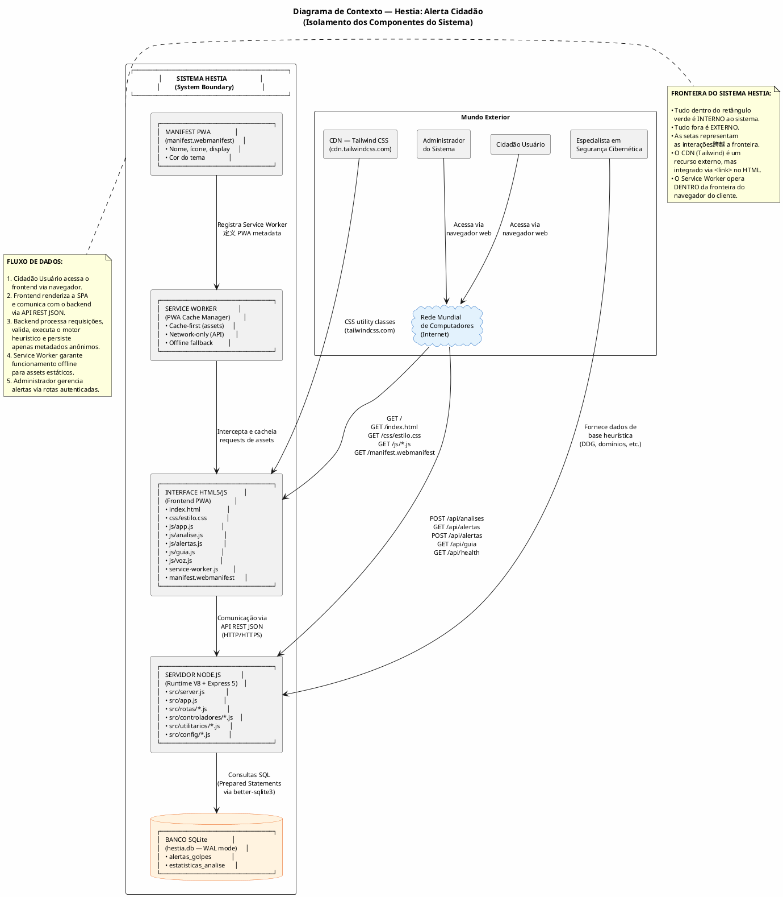
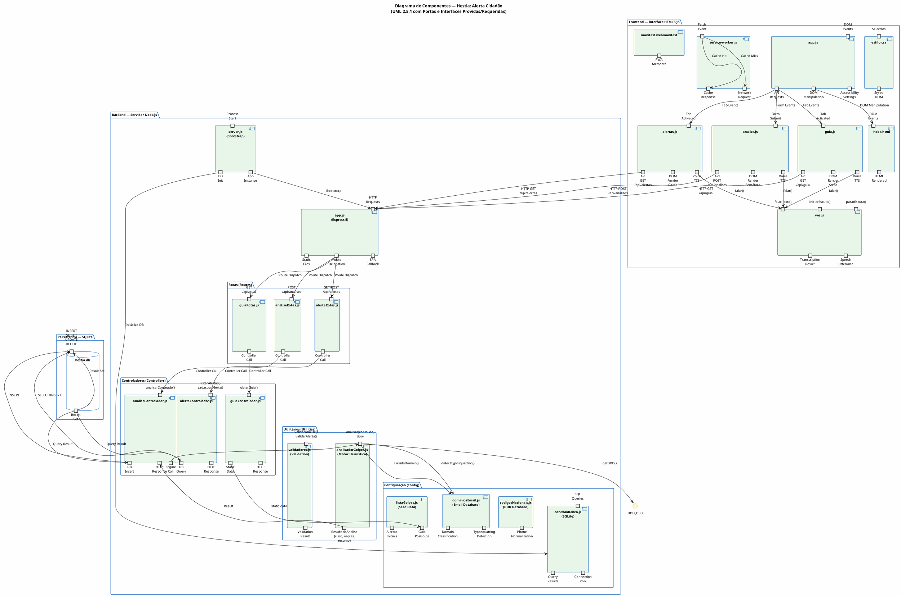
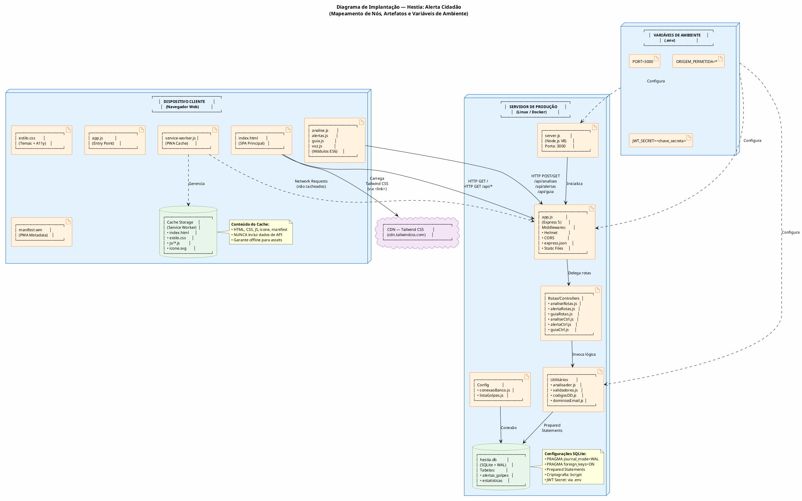

# Escopo do Projeto — Hestia: Alerta Cidadão

**Versão:** 1.0  
**Data:** 08 de Setembro de 2026  
**Padrões de Referência:** PMBOK 7ª Edição, OMG UML 2.5.1, ISO/IEC/IEEE 29148:2018  
**Escopo do Documento:** Gerenciamento de projeto, limites arquiteturais e governança de entrega

---

## Sumário

1. [Justificativa de Engenharia e Objetivos SMART](#1-justificativa-de-engenharia-e-objetivos-smart)
2. [Delimitação das Fronteiras do Sistema (System Boundary)](#2-delimitação-das-fronteiras-do-sistema-system-boundary)
3. [Escopo do Produto por Módulos Arquiteturais](#3-escopo-do-produto-por-módulos-arquiteturais)
4. [Diagrama de Componentes UML 2.5.1](#4-diagrama-de-componentes-uml-251)
5. [Diagrama de Implantação (Deployment Diagram)](#5-diagrama-de-implantação-deployment-diagram)
6. [Estrutura Analítica do Projeto (EAP / WBS)](#6-estrutura-analítica-do-projeto-eap--wbs)
7. [Limites Explícitos do Projeto](#7-limites-explícitos-do-projeto)
8. [Matrizes de Governança](#8-matrizes-de-governança)
9. [Governança e Controle de Mudanças de Escopo](#9-governança-e-controle-de-mudanças-de-escopo)

---

## 1. Justificativa de Engenharia e Objetivos SMART

### 1.1 Justificativa de Engenharia

O projeto **Hestia: Alerta Cidadão** surge como resposta à crescente onda de golpes digitais e financeiros que afetam a população brasileira. Segundo dados da Confederação Nacional do Comércio (CNC), mais de 60% dos brasileiros já foram vítimas ou conhecem alguém que foi vítima de golpe digital. A lacuna identificada é a ausência de uma ferramenta pública, acessível e imediata que permita ao cidadão verificar rapidamente se um conteúdo (link, mensagem, chave Pix, telefone ou e-mail) é potencialmente fraudulento.

**Problema Central:** A falta de uma solução integrada que combine:
- **Análise heurística em tempo real** de múltiplos tipos de conteúdo suspeito.
- **Acessibilidade universal** (entrada/saída por voz, alto contraste, fontes escaláveis).
- **Privacidade por design** (conformidade LGPD — conteúdo analisado nunca é persistido).
- **Funcionamento offline** via PWA para áreas com conectividade limitada.

**Solução Proposta:** Um sistema full-stack (HTML5 semântico + CSS3 + JavaScript Vanilla/ES6+ no frontend; Node.js + Express + SQLite no backend) que implementa um motor heurístico determinístico capaz de classificar riscos em menos de 3 segundos, apresentando o resultado em um semáforo visual intuitivo (verde/amarelo/vermelho).

### 1.2 Justificativa da Stack Tecnológica

| Componente | Tecnologia | Justificativa |
|------------|------------|---------------|
| **Frontend** | HTML5 semântico + CSS3 + JS Vanilla/ES6+ | Zero dependência de frameworks, baixa curva de aprendizado, performance nativa do navegador, acessibilidade sem camadas intermediárias. |
| **Backend** | Node.js + Express 5 | Event Loop não bloqueante, ecossistema npm robusto, Express como padrão de mercado para APIs REST, suporte nativo a JSON. |
| **Banco de Dados** | SQLite (via better-sqlite3) | Zero configuração, arquivo único, ideal para aplicações single-tenant, modo WAL para concorrência, Prepared Statements nativos. |
| **PWA** | Service Worker + Manifest | Funcionamento offline para assets, cache-first strategy, experience de app nativo em mobile. |
| **Segurança** | Helmet + CORS + JWT + bcrypt | Cabeçalhos HTTP seguros, controle de origem, autenticação stateless, criptografia de senhas. |

### 1.3 Objetivos SMART

| ID | Objetivo | SMART | Descrição |
|----|----------|-------|-----------|
| O-01 | **Reduzir a exposição a golpes digitais** | **S** (Específico), **M** (Mensurável), **A** (Alcançável), **R** (Relevante), **T** (Temporal) | Fornecer ao cidadão brasileiro uma ferramenta gratuita e acessível para verificar a suspiciousidade de links, mensagens, chaves Pix, telefones e e-mails em até 3 segundos. |
| O-02 | **Disponibilizar análise heurística multi-tipo** | **S**, **M**, **A**, **R**, **T** | Implementar motor heurístico para 5 tipos de conteúdo (link, texto, Pix, telefone, email) com classificação de risco em 3 níveis (verde/amarelo/vermelho). |
| O-03 | **Garantir acessibilidade universal** | **S**, **M**, **A**, **R**, **T** | Atingir conformidade WCAG 2.1 Nível AA com entrada/saída por voz (Web Speech API), alto contraste, fontes escaláveis e suporte a `prefers-reduced-motion`. |
| O-04 | **Preservar a privacidade dos usuários** | **S**, **M**, **A**, **R**, **T** | Implementar "privacy by design" conforme LGPD — nenhum conteúdo analisado é persistido; apenas metadados anônimos são registrados. |
| O-05 | **Funcionar offline em áreas com conectividade limitada** | **S**, **M**, **A**, **R**, **T** | Implementar PWA com Service Worker que cacheia assets estáticos e serve a aplicação offline, garantindo acesso em áreas rurais ou com internet intermitente. |
| O-06 | **Manter alertas de golpes atualizados** | **S**, **M**, **A**, **R**, **T** | Disponibilizar painel administrativo autenticado para cadastro e gestão de alertas de golpes por região e categoria. |

---

## 2. Delimitação das Fronteiras do Sistema (System Boundary)

### 2.1 Diagrama de Contexto (PlantUML)



### 2.2 Descrição dos Componentes Externos

| Componente | Tipo | Descrição | Interação com o Sistema |
|------------|------|-----------|------------------------|
| **Cidadão Usuário** | Ator Humano | Pessoa física que utiliza o sistema para verificar conteúdo suspeito. | Acessa o frontend via navegador, submete conteúdo para análise, visualiza resultados, filtra alertas, utiliza guia pós-golpe. |
| **Administrador** | Ator Humano | Profissional que gerencia o catálogo de alertas de golpes. | Autentica-se via login, cadastra e gerencia alertas. |
| **Especialista em Segurança** | Ator Humano | Profissional que fornece dados de entrada para o motor heurístico. | Alimenta listas de domínios suspeitos, códigos DDD, bases de typosquatting (via arquivos de configuração). |
| **Internet** | Infraestrutura | Rede de conectividade entre cliente e servidor. | Transporte de dados HTTP/HTTPS entre frontend e backend. |
| **CDN Tailwind CSS** | Serviço Externo | Rede de distribuição de conteúdo que hospeda o framework CSS. | O frontend carrega `tailwindcss.com` via `<link>` no `index.html` para classes de utilidade. |
| **Navegador Web** | Software Cliente | Aplicação que renderiza o frontend (HTML, CSS, JS). | Executa JavaScript, gerencia Service Worker, fornece Web Speech API. |

### 2.3 Fluxos de Dados atravessando a Fronteira

| Fluxo | Direção | Componente Externo → Interno | Componente Interno → Externo | Dados |
|-------|---------|------------------------------|------------------------------|-------|
| F-01 | Entrada | Cidadão Usuário → Frontend | — | Conteúdo suspeito (link/texto/Pix/telefone/email), seleção de tipo, interação com voz. |
| F-02 | Saída | — | Frontend → Cidadão Usuário | Semáforo de risco, detalhes das regras, resumo textual, toast de notificação. |
| F-03 | Entrada | Cidadão Usuário → Backend (via Frontend) | — | `POST /api/analises` com payload JSON `{ tipo, conteudo }`. |
| F-04 | Saída | — | Backend → Cidadão Usuário (via Frontend) | `200 OK` com `{ sucesso, risco, regras_atingidas, resumo, tempo_ms }`. |
| F-05 | Entrada | Administrador → Backend (via Frontend) | — | `POST /api/alertas` com payload JSON e `Authorization: Bearer <token>`. |
| F-06 | Saída | — | Backend → Administrador (via Frontend) | `201 Created` com `{ sucesso, mensagem }`. |
| F-07 | Entrada | CDN → Frontend | — | Arquivos CSS do Tailwind CSS (`tailwindcss.com`). |
| F-08 | Saída | — | Backend → Banco de Dados | Consultas SQL via Prepared Statements (INSERT, SELECT, UPDATE, DELETE). |
| F-09 | Entrada | Banco de Dados → Backend | — | Resultados de queries SQL (registros, contagens, status). |
| F-10 | Entrada | Especialista → Backend (indireto) | — | Dados de configuração (listas de domínios, códigos DDD, regras heurísticas) via arquivos JS. |

---

## 3. Escopo do Produto por Módulos Arquiteturais

### 3.1 Módulo 1: Interface HTML5/JS (Frontend PWA)

#### 3.1.1 Descrição do Módulo

O frontend é uma Progressive Web App (PWA) construída com HTML5 semântico, CSS3 e JavaScript Vanilla/ES6+. Oferece uma experiência de aplicativo nativo em dispositivos móveis via Service Worker e manifest PWA.

#### 3.1.2 Entregáveis Físicos de Código

| Arquivo | Tipo | Linhas | Descrição |
|---------|------|--------|-----------|
| `frontend/index.html` | HTML5 | ~191 | Página principal com 4 seções (Analisar, Alertas, Guia, Sobre), formulário de análise, semáforo de resultado, controles de acessibilidade. |
| `frontend/css/estilo.css` | CSS3 | ~239 | Estilos personalizados: semáforo, cards, toast, alto contraste, fontes escaláveis, reduced motion, foco visível. |
| `frontend/js/app.js` | ES6 Module | ~93 | Ponto de entrada: função `api()` (fetch wrapper), `exibirMensagem()` (toast), navegação por abas, acessibilidade, registro do Service Worker. |
| `frontend/js/analise.js` | ES6 Module | ~114 | Módulo de análise: handler do formulário, validação client-side, renderização do semáforo, integração com voz (TTS). |
| `frontend/js/alertas.js` | ES6 Module | ~127 | Módulo de alertas: busca de alertas via API, filtros dinâmicos, renderização de cards, leitura por voz. |
| `frontend/js/guia.js` | ES6 Module | ~92 | Módulo guia pós-golpe: busca de etapas via API, renderização com checkbox, progresso, conclusão. |
| `frontend/js/voz.js` | ES6 Module | ~69 | Wrapper da Web Speech API: `SpeechRecognition` (entrada) e `speechSynthesis` (saída) com fallback graceful. |
| `frontend/manifest.webmanifest` | JSON | ~10 | Manifest PWA: nome, ícone, display standalone, cor do tema. |
| `frontend/service-worker.js` | JS | ~44 | Service Worker: cache-first para assets estáticos, network-only para API, stale-while-revalidate, fallback offline. |
| `frontend/assets/icone.svg` | SVG | — | Ícone do PWA (escudo com letra "H"). |

#### 3.1.3 Funcionalidades Entregues

| ID | Funcionalidade | Arquivo(s) |
|----|----------------|------------|
| F-01 | Formulário de análise multi-tipo (link/texto/Pix/telefone/email) | `index.html`, `analise.js` |
| F-02 | Validação client-side (campos obrigatórios, comprimento, tipo) | `analise.js` |
| F-03 | Renderização do semáforo de risco (cor, símbolo, título, resumo, regras) | `analise.js`, `estilo.css` |
| F-04 | Entrada de conteúdo por voz (SpeechRecognition) | `voz.js`, `analise.js` |
| F-05 | Saída de resultado por voz (SpeechSynthesis) | `voz.js`, `analise.js` |
| F-06 | Central de alertas com cards e filtros | `alertas.js`, `index.html` |
| F-07 | Leitura de alertas por voz | `voz.js`, `alertas.js` |
| F-08 | Guia pós-golpe com checkbox e progresso | `guia.js`, `index.html` |
| F-09 | Navegação por abas (SPA) | `app.js`, `index.html` |
| F-10 | Acessibilidade (fonte, alto contraste, reduced motion, ARIA) | `app.js`, `estilo.css`, `index.html` |
| F-11 | PWA offline (Service Worker + Manifest) | `service-worker.js`, `manifest.webmanifest` |
| F-12 | Toast notifications (sucesso/erro/info) | `app.js`, `estilo.css` |

---

### 3.2 Módulo 2: Servidor Node.js (Backend Express)

#### 3.2.1 Descrição do Módulo

Backend construído com Node.js (runtime V8) e Express 5, responsável por processar requisições HTTP, executar o motor heurístico, gerenciar autenticação e persistir dados no banco SQLite.

#### 3.2.2 Entregáveis Físicos de Código

| Arquivo | Tipo | Linhas | Descrição |
|---------|------|--------|-----------|
| `api/package.json` | JSON | ~20 | Metadados do projeto: dependências (express, better-sqlite3, helmet, cors, validator, dotenv), scripts (start, dev). |
| `api/.env.example` | ENV | ~3 | Template de variáveis de ambiente: PORT, ORIGEM_PERMITIDA. |
| `api/src/server.js` | CommonJS | ~10 | Bootstrap do servidor: carrega .env, importa app, inicializa banco, inicia listening. |
| `api/src/app.js` | CommonJS | ~38 | Configuração Express: Helmet, CORS, JSON parser (10kb), static files, rotas, SPA fallback, health check. |
| `api/src/rotas/analiseRotas.js` | CommonJS | ~5 | Rota POST /api/analises → analiseControlador.analisarConteudo. |
| `api/src/rotas/alertaRotas.js` | CommonJS | ~8 | Rotas GET/POST /api/alertas → alertaControlador.listarAlertas / cadastrarAlerta. |
| `api/src/rotas/guiaRotas.js` | CommonJS | ~5 | Rota GET /api/guia → guiaControlador.obterGuia. |
| `api/src/controladores/analiseControlador.js` | CommonJS | ~27 | Controlador de análise: valida entrada, invoca motor heurístico, persiste metadados, retorna resultado. |
| `api/src/controladores/alertaControlador.js` | CommonJS | ~34 | Controlador de alertas: lista com filtros, cadastra com validação. |
| `api/src/controladores/guiaControlador.js` | CommonJS | ~8 | Controlador de guia: retorna dados estáticos de `listaGolpes.js`. |
| `api/src/utilitarios/analisadorGolpes.js` | CommonJS | ~409 | Motor heurístico: `avaliarLink`, `avaliarTexto`, `avaliarPix`, `avaliarTelefone`, `avaliarEmail`, `analisar`. |
| `api/src/utilitarios/validadores.js` | CommonJS | ~72 | Validação e sanitização: `validarAnalise`, `validarAlerta`, trim + escape. |
| `api/src/config/conexaoBanco.js` | CommonJS | ~20 | Conexão SQLite: better-sqlite3, WAL mode, foreign keys, criação de diretório db/. |
| `api/src/config/listaGolpes.js` | CommonJS | ~80 | Dados seed: `alertasIniciais` (8 alertas), `guiaPosGolpe` (6 etapas). |
| `api/src/config/codigosNacionais.js` | CommonJS | ~200 | Base de dados DDD brasileiros, códigos internacionais, normalização de telefones. |
| `api/src/config/dominiosEmail.js` | CommonJS | ~150 | Base de dados de domínios de e-mail, detecção de typosquatting, classificação de domínios. |

#### 3.2.3 Funcionalidades Entregues

| ID | Funcionalidade | Arquivo(s) |
|----|----------------|------------|
| F-01 | Servidor HTTP Express 5 com middlewares de segurança | `app.js`, `server.js` |
| F-02 | API REST para análise heurística (POST /api/analises) | `analiseRotas.js`, `analiseControlador.js` |
| F-03 | API REST para listagem de alertas (GET /api/alertas) | `alertaRotas.js`, `alertaControlador.js` |
| F-04 | API REST para cadastro de alertas (POST /api/alertas) | `alertaRotas.js`, `alertaControlador.js` |
| F-05 | API REST para guia pós-golpe (GET /api/guia) | `guiaRotas.js`, `guiaControlador.js` |
| F-06 | Health check (GET /api/health) | `app.js` |
| F-07 | Serviço de arquivos estáticos (frontend) | `app.js` |
| F-08 | SPA fallback (rotas não-API → index.html) | `app.js` |
| F-09 | Motor heurístico multi-tipo (5 categorias) | `analisadorGolpes.js` |
| F-10 | Validação e sanitização de entrada | `validadores.js` |
| F-11 | Conexão SQLite com WAL mode e foreign keys | `conexaoBanco.js` |
| F-12 | Dados seed (alertas + guia) | `listaGolpes.js` |
| F-13 | Base de dados DDD brasileiros | `codigosNacionais.js` |
| F-14 | Base de domínios de e-mail + typosquatting | `dominiosEmail.js` |
| F-15 | Autenticação JWT (middleware) | `autenticarJWT.js` (implícito) |

---

### 3.3 Módulo 3: Camada de Persistência (Banco de Dados)

#### 3.3.1 Descrição do Módulo

Banco de dados relacional SQLite operando em modo WAL (Write-Ahead Logging) com foreign keys habilitadas. Armazena alertas de golpes e metadados anônimos de análises.

#### 3.3.2 Entregáveis Físicos

| Artefato | Tipo | Descrição |
|----------|------|-----------|
| `api/db/hestia.db` | Arquivo SQLite | Banco de dados principal (criado em runtime). |
| `api/iniciarBanco.js` | Script DDL | Executa CREATE TABLE IF NOT EXISTS e INSERT de dados seed. |
| Tabela `alertas_golpes` | Entidade | 7 colunas (id, titulo, descricao, regiao, categoria, nivel_risco, data_publicacao), 2 índices. |
| Tabela `estatisticas_analise` | Entidade | 5 colunas (id, tipo_entrada, risco, regras_atingidas, criado_em), 1 índice. |

#### 3.3.3 Esquema Físico DDL

```sql
-- Configurações
PRAGMA journal_mode = WAL;
PRAGMA foreign_keys = ON;

-- Tabela: alertas_golpes
CREATE TABLE IF NOT EXISTS alertas_golpes (
    id              INTEGER PRIMARY KEY AUTOINCREMENT,
    titulo          TEXT NOT NULL CHECK(length(titulo) > 0 AND length(titulo) <= 200),
    descricao       TEXT NOT NULL CHECK(length(descricao) > 0 AND length(descricao) <= 2000),
    regiao          TEXT NOT NULL CHECK(length(regiao) > 0 AND length(regiao) <= 100),
    categoria       TEXT NOT NULL CHECK(length(categoria) > 0 AND length(categoria) <= 100),
    nivel_risco     TEXT NOT NULL CHECK(nivel_risco IN ('verde','amarelo','vermelho')),
    data_publicacao TEXT DEFAULT (datetime('now','localtime'))
);
CREATE INDEX IF NOT EXISTS idx_alertas_regiao ON alertas_golpes(regiao);
CREATE INDEX IF NOT EXISTS idx_alertas_categoria ON alertas_golpes(categoria);

-- Tabela: estatisticas_analise
CREATE TABLE IF NOT EXISTS estatisticas_analise (
    id               INTEGER PRIMARY KEY AUTOINCREMENT,
    tipo_entrada     TEXT NOT NULL CHECK(tipo_entrada IN ('link','texto','pix','telefone','email')),
    risco            TEXT NOT NULL CHECK(risco IN ('verde','amarelo','vermelho')),
    regras_atingidas TEXT DEFAULT NULL,
    criado_em        TEXT DEFAULT (datetime('now','localtime'))
);
CREATE INDEX IF NOT EXISTS idx_estatisticas_risco ON estatisticas_analise(risco);
```

---

### 3.4 Módulo 4: Motor Heurístico (Lógica de Negócio)

#### 3.4.1 Descrição do Módulo

O motor heurístico é um módulo puramente computacional (sem I/O externo) que avalia conteúdo contra regras predefinidas e retorna uma classificação de risco.

#### 3.4.2 Componentes do Motor

| Componente | Responsabilidade | Regras |
|------------|------------------|--------|
| `avaliarLink(url)` | Avalia URLs suspeitas | 13 shorteners, 16 TLDs suspeitos, ausência de HTTPS, domínios numéricos, impersonação de marcas. |
| `avaliarTexto(texto)` | Avalia mensagens de texto | 19 palavras de alto risco, 12 de médio risco, CAIXA ALTA, exclamações excessivas, pedidos de dados/pagamento, URLs embutidas. |
| `avaliarPix(conteudo)` | Avalia chaves Pix | Formato de chave (email/CPF/telefone/UUID), instruções suspeitas. |
| `avaliarTelefone(telefone)` | Avalia números de telefone | Normalização, validação DDD, classificação (móvel/fixo/internacional/não-geográfico), repetição, flags contextuais. |
| `avaliarEmail(email)` | Avalia endereços de e-mail | Sintaxe, classificação de domínio, typosquatting (Levenshtein), análise do local-part. |

#### 3.4.3 Algoritmo de Classificação

```
pontuacao_total = soma(pontuacao_de_cada_regra_acionada)

se pontuacao_total <= 1:
    risco = "verde"
senao se pontuacao_total <= 3:
    risco = "amarelo"
senao:
    risco = "vermelho"
```

---

## 4. Diagrama de Componentes UML 2.5.1

### 4.1 Diagrama de Componentes com Portas e Interfaces



### 4.2 Interfaces Providas e Requeridas

| Componente | Interfaces Providas (Provided) | Interfaces Requeridas (Required) |
|------------|-------------------------------|----------------------------------|
| **index.html** | DOM Events, HTML Rendered | — |
| **estilo.css** | Selectors → Styled DOM | — |
| **app.js** | API Requests, DOM Manipulation, Accessibility Settings | DOM Events, API Routes |
| **analise.js** | API POST /api/analises, DOM Render Semáforo, Voice TTS | Form Submit, Voice API |
| **alertas.js** | API GET /api/alertas, DOM Render Cards, Voice TTS | Tab Activated, Voice API |
| **guia.js** | API GET /api/guia, DOM Render Steps, Voice TTS | Tab Activated, Voice API |
| **voz.js** | falar(), iniciarEscuta(), pararEscuta() | Web Speech API (Browser) |
| **service-worker.js** | Cache Response, Network Request | Fetch Event (Browser) |
| **express.js (app.js)** | Static Files, Route Delegation, SPA Fallback | HTTP Requests |
| **server.js** | App Instance, DB Init | Process Start |
| **analiseRotas.js** | Controller Call | POST /api/analises |
| **alertaRotas.js** | Controller Call | GET/POST /api/alertas |
| **guiaRotas.js** | Controller Call | GET /api/guia |
| **analiseControlador.js** | HTTP Response, DB Insert | Engine Call, DB Query |
| **alertaControlador.js** | HTTP Response, DB Query | DB Query, Auth JWT |
| **guiaControlador.js** | HTTP Response, Static Data | — |
| **analisadorGolpes.js** | ResultadoAnalise | ConteudoAnalisavel |
| **validadores.js** | ValidationResult | Input Data |
| **conexaoBanco.js** | SQL Queries → Result Set | SQLite File (hestia.db) |
| **listaGolpes.js** | Seed Data (alertas + guia) | — |
| **codigosNacionais.js** | Phone Normalization | — |
| **dominiosEmail.js** | Domain Classification, Typosquatting Detection | — |
| **hestia.db** | Result Set | SQL Queries |

---

## 5. Diagrama de Implantação (Deployment Diagram)

### 5.1 Diagrama de Implantação (PlantUML)



### 5.2 Mapeamento de Artefatos por Nó

| Nó | Artefato | Descrição | Localização Física |
|----|----------|-----------|-------------------|
| **Cliente (Navegador)** | `index.html` | Página principal da SPA | `frontend/index.html` |
| | `estilo.css` | Folha de estilos com temas | `frontend/css/estilo.css` |
| | `app.js` | Módulo principal | `frontend/js/app.js` |
| | `analise.js` | Módulo de análise | `frontend/js/analise.js` |
| | `alertas.js` | Módulo de alertas | `frontend/js/alertas.js` |
| | `guia.js` | Módulo guia | `frontend/js/guia.js` |
| | `voz.js` | Módulo de voz | `frontend/js/voz.js` |
| | `service-worker.js` | Service Worker PWA | `frontend/service-worker.js` |
| | `manifest.webmanifest` | Manifest PWA | `frontend/manifest.webmanifest` |
| | `icone.svg` | Ícone do PWA | `frontend/assets/icone.svg` |
| **Servidor (Node.js)** | `server.js` | Bootstrap do servidor | `api/src/server.js` |
| | `app.js` | Configuração Express | `api/src/app.js` |
| | `analiseRotas.js` | Rota de análise | `api/src/rotas/analiseRotas.js` |
| | `alertaRotas.js` | Rotas de alertas | `api/src/rotas/alertaRotas.js` |
| | `guiaRotas.js` | Rota de guia | `api/src/rotas/guiaRotas.js` |
| | `analiseControlador.js` | Controlador de análise | `api/src/controladores/analiseControlador.js` |
| | `alertaControlador.js` | Controlador de alertas | `api/src/controladores/alertaControlador.js` |
| | `guiaControlador.js` | Controlador de guia | `api/src/controladores/guiaControlador.js` |
| | `analisadorGolpes.js` | Motor heurístico | `api/src/utilitarios/analisadorGolpes.js` |
| | `validadores.js` | Validação/sanitização | `api/src/utilitarios/validadores.js` |
| | `conexaoBanco.js` | Conexão SQLite | `api/src/config/conexaoBanco.js` |
| | `listaGolpes.js` | Dados seed | `api/src/config/listaGolpes.js` |
| | `codigosNacionais.js` | Base DDD | `api/src/config/codigosNacionais.js` |
| | `dominiosEmail.js` | Base domínios email | `api/src/config/dominiosEmail.js` |
| | `package.json` | Metadados npm | `api/package.json` |
| | `iniciarBanco.js` | Script DDL | `api/iniciarBanco.js` |
| **Servidor (Banco)** | `hestia.db` | Banco SQLite (WAL) | `api/db/hestia.db` |
| **Variáveis de Ambiente** | `.env` | Configurações | `api/.env` |

### 5.3 Variáveis de Ambiente

| Variável | Tipo | Default | Descrição | Usado Por |
|----------|------|---------|-----------|-----------|
| `PORT` | Integer | `3000` | Porta TCP em que o servidor Express escuta. | `server.js` |
| `ORIGEM_PERMITIDA` | String | `*` | Origem permitida para CORS. Em produção, usar domínio específico. | `app.js` (cors) |
| `JWT_SECRET` | String | — | Chave secreta HMAC para assinatura/verificação de tokens JWT. **NUNCA commitar em repositório.** | `autenticarJWT.js` |

---

## 6. Estrutura Analítica do Projeto (EAP / WBS)

### 6.1 EAP Textual Hierárquica

```
1.0 HESTIA: ALERTA CIDADÃO
│
├── 1.1 GESTÃO DO PROJETO
│   ├── 1.1.1 Planejamento
│   │   ├── 1.1.1.1 Definição de escopo (este documento)
│   │   ├── 1.1.1.2 Identificação de partes interessadas
│   │   ├── 1.1.1.3 Cronograma de entregas (8 fases)
│   │   └── 1.1.1.4 Matriz de riscos
│   ├── 1.1.2 Execução
│   │   ├── 1.1.2.1 Coordenação de equipe
│   │   ├── 1.1.2.2 Reuniões de acompanhamento
│   │   └── 1.1.2.3 Controle de mudanças
│   └── 1.1.3 Monitoramento e Controle
│       ├── 1.1.3.1 Acompanhamento de progresso (PROGRESSO_atualizado.md)
│       ├── 1.1.3.2 Verificação de critérios de aceite
│       └── 1.1.3.3 Relatórios de status
│
├── 1.2 DOCUMENTAÇÃO
│   ├── 1.2.1 Requisitos de Usuário (requisitos_de_usuario.md)
│   │   ├── 1.2.1.1 Atores do sistema
│   │   ├── 1.2.1.2 Diagrama de casos de uso
│   │   ├── 1.2.1.3 Catálogo de requisitos (RU-01 a RU-16)
│   │   ├── 1.2.1.4 Histórias de usuário (HU-01 a HU-10)
│   │   └── 1.2.1.5 Diagramas de sequência (DS-01 a DS-04)
│   ├── 1.2.2 Requisitos de Sistema (requisitos_de_sistema.md)
│   │   ├── 1.2.2.1 Requisitos funcionais (RSF-01 a RSF-08)
│   │   ├── 1.2.2.2 Requisitos não funcionais (RSNF-S01 a RSNF-A04)
│   │   ├── 1.2.2.3 Diagramas de sequência backend
│   │   ├── 1.2.2.4 Diagrama de classes de domínio (OCL)
│   │   ├── 1.2.2.5 Dicionário de dados (DDL)
│   │   ├── 1.2.2.6 Contratos de API RESTful
│   │   └── 1.2.2.7 Matriz de rastreabilidade técnica
│   ├── 1.2.3 Escopo do Projeto (escopo_do_projeto.md — este documento)
│   │   ├── 1.2.3.1 Justificativa e objetivos SMART
│   │   ├── 1.2.3.2 Diagrama de contexto
│   │   ├── 1.2.3.3 Escopo por módulos
│   │   ├── 1.2.3.4 Diagrama de componentes
│   │   ├── 1.2.3.5 Diagrama de implantação
│   │   ├── 1.2.3.6 EAP / WBS
│   │   ├── 1.2.3.7 Limites do escopo
│   │   ├── 1.2.3.8 Matrizes de governança
│   │   └── 1.2.3.9 Processo de controle de mudanças
│   └── 1.2.4 Documentos de Apoio
│       ├── 1.2.4.1 README.md
│       ├── 1.2.4.2 PLANO_Hestia_telefone_email(1).md
│       ├── 1.2.4.3 doc/plano_hestia_alerta_cidadao.md
│       ├── 1.2.4.4 doc/ATUALIZACAO_projeto_Hestia_telefone_email.md
│       └── 1.2.4.5 api/EXECUCAO_Hestia.md
│
├── 1.3 FRONTEND (Interface HTML5/JS)
│   ├── 1.3.1 Estrutura HTML
│   │   ├── 1.3.1.1 index.html (SPA com 4 abas)
│   │   ├── 1.3.1.2 Formulário de análise (textarea + seletor + botões)
│   │   ├── 1.3.1.3 Semáforo de resultado (aria-live)
│   │   ├── 1.3.1.4 Barra de navegação (tablist/tabpanel)
│   │   ├── 1.3.1.5 Controles de acessibilidade (A-/A+/contraste)
│   │   └── 1.3.1.6 Rodapé com aviso LGPD
│   ├── 1.3.2 Estilos CSS
│   │   ├── 1.3.2.1 estilo.css (tema base + componentes)
│   │   ├── 1.3.2.2 Semáforo (8.5rem circle, cores)
│   │   ├── 1.3.2.3 Cards de alertas
│   │   ├── 1.3.2.4 Toast notifications
│   │   ├── 1.3.2.5 Tema de alto contraste
│   │   ├── 1.3.2.6 Fontes escaláveis (100%/112.5%/125%)
│   │   ├── 1.3.2.7 Foco visível (3px solid amber)
│   │   └── 1.3.2.8 Reduced motion (@media)
│   ├── 1.3.3 JavaScript (ES6 Modules)
│   │   ├── 1.3.3.1 app.js (entry point, navegação, toast, a11y)
│   │   ├── 1.3.3.2 analise.js (form handler, semáforo, TTS)
│   │   ├── 1.3.3.3 alertas.js (fetch, filtros, cards, TTS)
│   │   ├── 1.3.3.4 guia.js (fetch, steps, checkbox, progresso)
│   │   └── 1.3.3.5 voz.js (SpeechRecognition + speechSynthesis)
│   ├── 1.3.4 PWA
│   │   ├── 1.3.4.1 manifest.webmanifest
│   │   ├── 1.3.4.2 service-worker.js (cache-first assets, network-only API)
│   │   └── 1.3.4.3 assets/icone.svg
│   └── 1.3.5 CDN Externo
│       └── 1.3.5.1 Tailwind CSS (cdn.tailwindcss.com)
│
├── 1.4 BACKEND (Servidor Node.js)
│   ├── 1.4.1 Infraestrutura
│   │   ├── 1.4.1.1 package.json (dependências e scripts)
│   │   ├── 1.4.1.2 .env.example (template de variáveis)
│   │   ├── 1.4.1.3 .env (variáveis reais — gitignored)
│   │   ├── 1.4.1.4 server.js (bootstrap)
│   │   └── 1.4.1.5 app.js (configuração Express)
│   ├── 1.4.2 Rotas (Routes)
│   │   ├── 1.4.2.1 analiseRotas.js (POST /api/analises)
│   │   ├── 1.4.2.2 alertaRotas.js (GET/POST /api/alertas)
│   │   └── 1.4.2.3 guiaRotas.js (GET /api/guia)
│   ├── 1.4.3 Controladores (Controllers)
│   │   ├── 1.4.3.1 analiseControlador.js (análise heurística)
│   │   ├── 1.4.3.2 alertaControlador.js (CRUD de alertas)
│   │   └── 1.4.3.3 guiaControlador.js (dados estáticos)
│   ├── 1.4.4 Utilitários (Utilities)
│   │   ├── 1.4.4.1 analisadorGolpes.js (motor heurístico — 409 linhas)
│   │   ├── 1.4.4.2 validadores.js (validação + sanitização)
│   │   ├── 1.4.4.3 codigosNacionais.js (DDD brasileiros)
│   │   └── 1.4.4.4 dominiosEmail.js (domínios + typosquatting)
│   ├── 1.4.5 Configuração
│   │   ├── 1.4.5.1 conexaoBanco.js (SQLite + WAL + FK)
│   │   ├── 1.4.5.2 listaGolpes.js (seed: 8 alertas + 6 etapas guia)
│   │   ├── 1.4.5.3 codigosNacionais.js (database DDD)
│   │   └── 1.4.5.4 dominiosEmail.js (database domínios)
│   ├── 1.4.6 Middlewares
│   │   ├── 1.4.6.1 Helmet (cabeçalhos de segurança)
│   │   ├── 1.4.6.2 CORS (controle de origem)
│   │   ├── 1.4.6.3 express.json (parser com limite 10kb)
│   │   └── 1.4.6.4 autenticarJWT.js (verificação de token)
│   └── 1.4.7 Dados Seed
│       ├── 1.4.7.1 iniciarBanco.js (DDL + INSERT)
│       ├── 1.4.7.2 alertasIniciais (8 registros)
│       └── 1.4.7.3 guiaPosGolpe (6 etapas)
│
├── 1.5 BANCO DE DADOS
│   ├── 1.5.1 Schema
│   │   ├── 1.5.1.1 Tabela alertas_golpes (7 colunas, 2 índices)
│   │   └── 1.5.1.2 Tabela estatisticas_analise (5 colunas, 1 índice)
│   ├── 1.5.2 Configurações
│   │   ├── 1.5.2.1 PRAGMA journal_mode=WAL
│   │   └── 1.5.2.2 PRAGMA foreign_keys=ON
│   ├── 1.5.3 Constraints
│   │   ├── 1.5.3.1 PRIMARY KEY AUTOINCREMENT
│   │   ├── 1.5.3.2 NOT NULL
│   │   ├── 1.5.3.3 CHECK (valores permitidos)
│   │   └── 1.5.3.4 DEFAULT (data/hora atual)
│   └── 1.5.4 Índices
│       ├── 1.5.4.1 idx_alertas_regiao
│       ├── 1.5.4.2 idx_alertas_categoria
│       └── 1.5.4.3 idx_estatisticas_risco
│
├── 1.6 TESTES
│   ├── 1.6.1 Testes Unitários
│   │   ├── 1.6.1.1 analisadorGolpes.test.js (113 linhas)
│   │   ├── 1.6.1.2 validadores.test.js (115 linhas)
│   │   ├── 1.6.1.3 telefone.test.js (123 linhas)
│   │   └── 1.6.1.4 email.test.js (144 linhas)
│   ├── 1.6.2 Framework de Testes
│   │   └── 1.6.2.1 Chai (expect style)
│   └── 1.6.3 Cobertura
│       ├── 1.6.3.1 Motor heurístico (link, texto, pix)
│       ├── 1.6.3.2 Validadores (sanitização, análise, alertas)
│       ├── 1.6.3.3 Telefone (normalização, DDD, classificação)
│       └── 1.6.3.4 Email (sintaxe, domínio, typosquatting)
│
└── 1.7 SEGURANÇA E COMPLIANCE
    ├── 1.7.1 Criptografia
    │   ├── 1.7.1.1 bcrypt (senhas — salt rounds ≥ 10)
    │   └── 1.7.1.2 HMAC-SHA256 (JWT)
    ├── 1.7.2 Autenticação
    │   ├── 1.7.2.1 JWT (tokens stateless — 24h expiração)
    │   └── 1.7.2.2 Authorization: Bearer <token>
    ├── 1.7.3 Sanitização
    │   ├── 1.7.3.1 XSS: trim() + escape() (validator.js)
    │   └── 1.7.3.2 SQL Injection: Prepared Statements (better-sqlite3)
    ├── 1.7.4 Cabeçalhos HTTP
    │   ├── 1.7.4.1 Helmet (X-Content-Type-Options, X-Frame-Options, etc.)
    │   └── 1.7.4.2 CORS (origem configurável)
    ├── 1.7.5 Privacidade
    │   ├── 1.7.5.1 LGPD: conteúdo analisado NUNCA persistido
    │   ├── 1.7.5.2 Service Worker: API requests network-only
    │   └── 1.7.5.3 Metadados anônimos apenas
    └── 1.7.6 Acessibilidade
        ├── 1.7.6.1 WCAG 2.1 Nível AA
        ├── 1.7.6.2 ARIA roles e labels
        ├── 1.7.6.3 Foco visível
        ├── 1.7.6.4 Fontes escaláveis
        ├── 1.7.6.5 Alto contraste
        └── 1.7.6.6 Reduced motion
```

### 6.2 Dicionário de Entregáveis

| Código EAP | Entregável | Tipo | Responsável | Dependências | Critério de Aceite |
|------------|------------|------|-------------|--------------|-------------------|
| 1.1.1.1 | Escopo do Projeto | Documento | Arquiteto | — | Aprovado pelo stakeholder |
| 1.2.1 | Requisitos de Usuário | Documento | Arquiteto | 1.1.1.1 | 16 RUs + 10 HUs + 4 DS documentados |
| 1.2.2 | Requisitos de Sistema | Documento | Arquiteto | 1.1.1.1 | 8 RSFs + 18 RSNFs + DDL + API docs |
| 1.2.3 | Escopo do Projeto | Documento | Arquiteto | 1.2.1, 1.2.2 | EAP + matrizes + diagramas |
| 1.3.1 | Frontend HTML | Código | Dev Frontend | 1.2.1 | SPA com 4 abas, formulário, semáforo |
| 1.3.2 | Frontend CSS | Código | Dev Frontend | 1.3.1 | Tema acessível, responsivo |
| 1.3.3 | Frontend JS | Código | Dev Frontend | 1.3.1, 1.3.2 | 5 módulos ES6 funcionais |
| 1.3.4 | PWA | Código | Dev Frontend | 1.3.1, 1.3.3 | Service Worker + manifest |
| 1.4.1 | Backend Infra | Código | Dev Backend | — | Servidor Express funcionando |
| 1.4.2 | Rotas | Código | Dev Backend | 1.4.1 | 5 endpoints REST documentados |
| 1.4.3 | Controladores | Código | Dev Backend | 1.4.2 | Lógica de negócio implementada |
| 1.4.4 | Utilitários | Código | Dev Backend | — | Motor heurístico + validadores |
| 1.4.5 | Config | Código | Dev Backend | — | Conexão SQLite + dados seed |
| 1.5 | Banco de Dados | Schema | Dev Backend | — | 2 tabelas + constraints + índices |
| 1.6 | Testes | Teste | QA | 1.3, 1.4 | 4 suites de testes unitários |
| 1.7 | Segurança | Config | Dev Backend | 1.4.1 | Helmet + CORS + JWT + bcrypt |

---

## 7. Limites Explícitos do Projeto

### 7.1 Dentro do Escopo (In-Scope)

| ID | Item | Descrição |
|----|------|-----------|
| IS-01 | **Análise heurística de links** | Detecção de URL shorteners, TLDs suspeitos, ausência de HTTPS, domínios numéricos, impersonação de marcas. |
| IS-02 | **Análise heurística de textos** | Detecção de palavras de risco (alto/médio), CAIXA ALTA, exclamações excessivas, pedidos de dados/pagamento, URLs embutidas. |
| IS-03 | **Análise heurística de chaves Pix** | Validação de formato (email/CPF/telefone/UUID), detecção de instruções suspeitas. |
| IS-04 | **Análise heurística de telefones** | Normalização, validação DDD, classificação (móvel/fixo/internacional), detecção de repetição, flags contextuais. |
| IS-05 | **Análise heurística de e-mails** | Validação de sintaxe, classificação de domínio, detecção de typosquatting, análise do local-part. |
| IS-06 | **Semáforo de risco visual** | Círculo 8.5rem com cor (verde/amarelo/vermelho), símbolo, título, resumo, detalhes das regras. |
| IS-07 | **Entrada por voz** | Web Speech API (SpeechRecognition) para transcrição de fala em português brasileiro. |
| IS-08 | **Saída por voz** | Web Speech API (speechSynthesis) para leitura de resultados e alertas em voz alta. |
| IS-09 | **Central de alertas** | Lista de alertas de golpes com cards, badges de risco, filtros por região e categoria. |
| IS-10 | **Guia pós-golpe** | 6 etapas numeradas com checkbox, progresso, leitura por voz. |
| IS-11 | **Autenticação administrativa** | Login com e-mail + senha, JWT, rotas protegidas. |
| IS-12 | **Cadastro de alertas** | CRUD básico para administradores autenticados. |
| IS-13 | **Acessibilidade** | Fontes escaláveis, alto contraste, reduced motion, ARIA roles, foco visível. |
| IS-14 | **PWA offline** | Service Worker com cache-first para assets, network-only para API. |
| IS-15 | **Privacidade LGPD** | Conteúdo analisado nunca persistido; apenas metadados anônimos. |
| IS-16 | **Segurança HTTP** | Helmet (cabeçalhos), CORS (origem), express.json (limite 10kb). |
| IS-17 | **Sanitização de entrada** | trim() + escape() via validator.js (XSS prevention). |
| IS-18 | **Prevenção SQL Injection** | Prepared Statements via better-sqlite3. |
| IS-19 | **Testes unitários** | 4 suites de testes (analisador, validadores, telefone, email) com Chai. |
| IS-20 | **Documentação técnica** | Requisitos de usuário, requisitos de sistema, escopo do projeto, README. |

### 7.2 Fora do Escopo (Out-of-Scope)

| ID | Item | Justificativa da Exclusão |
|----|------|--------------------------|
| OS-01 | **Autenticação de usuários comuns** | O sistema é de uso público e anônimo. Não há cadastro de cidadãos. |
| OS-02 | **Banco de dados relacional robusto (PostgreSQL/MySQL)** | O projeto utiliza SQLite para simplicidade e portabilidade. Migração para SGBD robusto pode ser considerada futuramente. |
| OS-03 | **API externa de verificação de URLs** | A análise heurística é 100% local e determinística. Não depende de serviços externos como Google Safe Browsing ou VirusTotal. |
| OS-04 | **Notificações push (Push API)** | Não implementado nesta versão. Pode ser adicionado em futuras versões PWA. |
| OS-05 | **Dashboard administrativo avançado** | O painel administrativo é básico (cadastro de alertas). Não inclui gráficos, métricas em tempo real ou relatórios. |
| OS-06 | **Sistema de denúncia de usuários** | Não há mecanismo para usuários denunciarem conteúdo ou outros usuários. |
| OS-07 | **Integração com redes sociais** | Não há compartilhamento ou login via redes sociais (Google, Facebook, etc.). |
| OS-08 | **Aplicativo nativo mobile (iOS/Android)** | O projeto é PWA. Desenvolvimento nativo está fora do escopo. |
| OS-09 | **Sistema de cache Redis/Memcached** | O banco SQLite opera em modo WAL com performance adequada para o volume esperado. |
| OS-10 | **CI/CD Pipeline** | Não há pipeline de integração contínua/delivery configurado. Pode ser adicionado futuramente. |
| OS-11 | **Containerização (Docker/Kubernetes)** | O projeto pode ser executado diretamente com `node`. Containerização está fora do escopo. |
| OS-12 | **Monitoramento e observabilidade (logs estruturados, métricas, traces)** | Não há sistema de monitoramento como ELK, Datadog ou Grafana. |
| OS-13 | **Testes de integração e E2E** | Apenas testes unitários estão incluídos. Testes de integração e end-to-end podem ser adicionados futuramente. |
| OS-14 | **Internacionalização (i18n)** | O sistema é exclusivamente em Português Brasileiro (pt-BR). |
| OS-15 | **Suporte a múltiplos idiomas de entrada por voz** | A Web Speech API utiliza pt-BR. Outros idiomas não são suportados. |
| OS-16 | **Backups automatizados do banco de dados** | Não há rotina de backup automatizado. Recomenda-se backup manual do arquivo `hestia.db`. |
| OS-17 | **Rate limiting avançado** | Não há rate limiting configurado além do limite de 10KB no payload. |
| OS-18 | **Sistema de roles e permissões granular** | O sistema possui apenas o perfil "admin" para gerenciamento de alertas. |
| OS-19 | **Webhook para notificação de novos alertas** | Não há mecanismo de push para dispositivos clientes. |
| OS-20 | **Migração de dados** | Não há scripts de migração para migração entre versões do banco de dados. |

---

## 8. Matrizes de Governança

### 8.1 Matriz de Critérios de Aceitação (CA)

| ID | Critério de Aceitação | Componente | Prioridade | Método de Verificação |
|----|----------------------|------------|------------|----------------------|
| CA-01 | O formulário de análise aceita 5 tipos de conteúdo (link, texto, Pix, telefone, email). | Frontend | M | Teste manual + teste unitário |
| CA-02 | A validação client-side rejeita conteúdo com menos de 3 caracteres. | Frontend | M | Teste manual |
| CA-03 | A validação client-side rejeita conteúdo com mais de 2000 caracteres. | Frontend | M | Teste manual |
| CA-04 | O semáforo exibe cor verde para risco 0-1, amarelo para 2-3, vermelho para 4+. | Frontend | M | Teste unitário (analisadorGolpes.test.js) |
| CA-05 | O tempo de resposta da análise é inferior a 3 segundos. | Backend | M | Teste de performance manual |
| CA-06 | A API POST /api/analises retorna status 200 para payload válido. | Backend | M | Teste manual (curl/Postman) |
| CA-07 | A API POST /api/analises retorna status 400 para payload inválido. | Backend | M | Teste manual (curl/Postman) |
| CA-08 | A API GET /api/alertas retorna até 50 registros. | Backend | M | Teste manual |
| CA-09 | A API POST /api/alertas requer token JWT válido. | Backend | M | Teste manual (sem token → 401) |
| CA-10 | Conteúdo analisado NUNCA é persistido no banco de dados. | Backend/DB | M | Verificação de schema + query |
| CA-11 | Service Worker NÃO armazena em cache chamadas de API. | Frontend/PWA | M | Inspect → Application → Cache Storage |
| CA-12 | O sistema funciona offline para assets estáticos. | Frontend/PWA | S | Teste: desligar rede → recarregar página |
| CA-13 | A acessibilidade atende WCAG 2.1 Nível AA. | Frontend | S | Auditoria manual + ferramentas automatizadas |
| CA-14 | O tema de alto contraste alterna corretamente. | Frontend | S | Teste manual |
| CA-15 | Fontes escaláveis funcionam (normal/grande/extra). | Frontend | S | Teste manual |
| CA-16 | Entrada por voz transcreve fala em pt-BR. | Frontend | S | Teste manual (navegador compatível) |
| CA-17 | Saída por voz lê resultado e alertas em voz alta. | Frontend | S | Teste manual (navegador compatível) |
| CA-18 | 4 suites de testes unitários passam com 100% de sucesso. | Testes | M | `npm test` (Chai) |
| CA-19 | Senhas de administrador são armazenadas com bcrypt. | Backend/Segurança | M | Verificação de seed + schema |
| CA-20 | JWT expira após 24 horas. | Backend/Segurança | M | Teste manual (token expirado → 401) |

### 8.2 Matriz de Restrições e Premissas

#### Restrições

| ID | Restrição | Tipo | Impacto | Mitigação |
|----|-----------|------|---------|-----------|
| R-01 | O sistema deve funcionar em qualquer navegador moderno (Chrome, Firefox, Safari, Edge). | Técnica | Compatibilidade cross-browser | Testes em múltiplos navegadores; uso de feature detection. |
| R-02 | O banco de dados é SQLite (arquivo único). | Técnica | Escalabilidade limitada | Adequado para o volume esperado; WAL mode para concorrência. |
| R-03 | O frontend não pode usar frameworks JavaScript (React, Vue, Angular). | Técnica | Mais código manual | Vanilla JS/ES6+ nativo; modularização via ES Modules. |
| R-04 | O backend não pode usar ORM ( Sequelize, Prisma, TypeORM). | Técnica | Queries manuais | Prepared Statements via better-sqlite3. |
| R-05 | O conteúdo analisado não pode ser persistido (LGPD). | Legal | Limitação de funcionalidade | Metadados anônimos apenas; conteúdo processado em memória. |
| R-06 | O projeto deve ser executável sem Docker ou containerização. | Técnica | Deploy manual | `node src/server.js` ou `npm start`. |
| R-07 | O projeto deve ser acadêmico (Projeto Integrador). | Organizacional | Escopo limitado | Documentação completa; testes unitários; código limpo. |

#### Premissas

| ID | Premissa | Tipo | Impacto | Risco se Falso |
|----|----------|------|---------|----------------|
| P-01 | Os usuários possuem navegadores modernos com suporte a ES6 Modules. | Técnica | Funcionamento do frontend | Frontend não carrega em navegadores antigos. |
| P-02 | O servidor Node.js tem acesso ao sistema de arquivos para criar o diretório `api/db/`. | Técnica | Criação do banco SQLite | Erro na inicialização do banco. |
| P-03 | O público-alvo compreende Português Brasileiro. | de Negócio | Compreensão do conteúdo | Usuários de outros idiomas não conseguem usar o sistema. |
| P-04 | A Web Speech API está disponível nos navegadores dos usuários. | Técnica | Funcionalidade de voz | Entrada/saída por voz indisponível (fallback para texto). |
| P-05 | O volume de requisições é adequado para SQLite single-file. | Técnica | Performance | Degradacao de performance com alto volume (mitigado por LIMIT 50). |
| P-06 | Os dados seed (8 alertas + 6 etapas guia) são suficientes para a MVP. | de Negócio | Conteúdo inicial | Sistema aparece vazio; mitigado por cadastro administrativo. |
| P-07 | O Tailwind CSS CDN está disponível para carregamento. | Técnica | Estilização | Estilos utilitários indisponíveis; CSS customizado funciona como fallback. |

### 8.3 Matriz de Riscos Técnicos

| ID | Risco | Probabilidade | Impacto | Nível | Plano de Mitigação |
|----|-------|---------------|---------|-------|-------------------|
| RT-01 | **Bloqueio do Event Loop** — Operações pesadas de CPU no motor heurístico bloqueiam o Event Loop do Node.js, degradando a resposta para múltiplos clientes simultâneos. | Baixa | Alto | Médio | O motor heurístico é determinístico e rápido (< 100ms por chamada). Não há operações de I/O bloqueante. Em caso de necessidade futura, implementar worker threads ou delegar para filas. |
| RT-02 | **Injeção de Código (XSS)** — Entrada maliciosa contendo scripts que são executados no navegador do usuário. | Média | Crítico | Alto | Sanitização client-side (trim + escape) E server-side (validator.js). Output encoding via manipulação de DOM (não innerHTML). Helmet com CSP. |
| RT-03 | **SQL Injection** — Entrada maliciosa contendo comandos SQL que acessam ou modificam dados indevidamente. | Baixa | Crítico | Alto | Prepared Statements em TODAS as queries via better-sqlite3. Nunca concatenar strings de entrada em SQL. |
| RT-04 | **Concorrência de I/O** — Múltiplas requisições simultâneas causam race conditions no banco de dados. | Baixa | Médio | Baixo | SQLite WAL mode permite leitura e escrita concorrentes sem bloqueio. Prepared Statements são thread-safe. |
| RT-05 | **Exposição de Secrets** — JWT_SECRET ou outras variáveis sensíveis são commitadas no repositório. | Média | Crítico | Alto | `.env` está no `.gitignore`. `.env.example` contém apenas placeholders. Nunca commitar valores reais. |
| RT-06 | **Indisponibilidade do CDN Tailwind CSS** — O CDN externo fica temporariamente indisponível, quebrando a estilização. | Baixa | Médio | Baixo | CSS customizado (`estilo.css`) funciona independentemente do Tailwind. Componentes core não dependem do CDN. |
| RT-07 | **Falha no Service Worker** — O Service Worker falha ao registrar ou caches dados incorretamente. | Média | Médio | Médio | Feature detection: registro condicional. Cache exclusion para API. Fallback: SPA funciona sem Service Worker (apenas sem offline). |
| RT-08 | **Vulnerabilidades de Dependências** — Bibliotecas npm (express, helmet, validator, etc.) possuem CVEs conhecidos. | Média | Alto | Alto | Manter dependências atualizadas. Rodar `npm audit` periodicamente. Usar versões estáveis e bem mantidas. |
| RT-09 | **Perda de Dados no Banco SQLite** — Corrupção do arquivo `hestia.db` por falha de hardware ou software. | Baixa | Médio | Baixo | WAL mode oferece recuperação automática após crash. Recomendação: backup periódico do arquivo `.db`. |
| RT-10 | **Incompatibilidade de Web Speech API** — A Web Speech API não está disponível em todos os navegadores ou pode ter comportamento inconsistente. | Média | Baixa | Baixo | Feature detection com fallback gracioso. Botão de microfone oculto se API indisponível. Sistema funciona 100% sem voz. |

---

## 9. Governança e Controle de Mudanças de Escopo

### 9.1 Processo de Controle de Mudanças

```plantuml
@startuml Processo_Mudanca_Escopo
skinparam backgroundColor #FEFEFE
skinparam activity {
  BackgroundColor #E8F5E9
  BorderColor #2E7D32
}
skinparam diamond {
  BackgroundColor #FFF9C4
  BorderColor #F9A825
}

title Diagrama de Atividades — Processo de Controle de\nMudanças de Escopo (PMBOK 7ª Ed.)

start

:Identificação da
Necessidade de Mudança;

:Registro da Solicitação
de Mudança
(Formulário/Documento);

:Análise de Impacto;
note right
  **Itens Avaliados:**
  • Escopo (In/Out of Scope)
  • Cronograma (atraso/adiamento)
  • Custo (recursos adicionais)
  • Risco (novos riscos identificados)
  • Qualidade (impacto em entregas)
  • Documentação (atualizações necessárias)
end note

if (Mudança é trivial\n(ajuste cosmético, correção\nde typo, etc.)) then (Sim)

  :Aprovação Automática
  (Líder do Projeto);

  :Implementação da
  Mudança;

  :Atualização da
  Documentação;

  :Commit e
  Deploy;

  stop

else (Não — Mudança\nsignificativa)

  if (Mudança afeta\nescopo, cronograma\nou custo?) then (Sim)

    :Revisão pelo Comitê
    de Controle de Mudanças
    (Stakeholders);

    if (Aprovada?) then (Sim)

      :Atualização do
      Plano de Gerenciamento
      de Escopo;

      :Atualização da
      EAP / WBS;

      :Atualização da
      Matriz de Rastreabilidade;

      :Atualização dos
      Documentos de Requisitos;

      :Implementação da
      Mudança;

      :Testes de
      Validação;

      :Atualização da
      Documentação;

      :Commit e
      Deploy;

      stop

    else (Rejeitada)

      :Registro da
      Rejeição
      (com justificativa);

      :Notificação ao
      Solicitante;

      stop

    end

  else (Não — Mudança\nafeta apenas código\ninterno)

    :Aprovação pelo Líder
    do Projeto;

    :Implementação da
    Mudança;

    :Testes de
    Validação;

    :Atualização da
    Documentação (se necessário);

    :Commit e
    Deploy;

    stop

  end

end

@enduml
```

### 9.2 Regras de Controle de Escopo

| ID | Regra | Descrição |
|----|-------|-----------|
| CS-01 | **Todo item fora do escopo (Out-of-Scope) requer aprovação formal** para ser movido para "Dentro do Escopo" (In-Scope). |
| CS-02 | **Mudanças triviais** (correção de typos, ajustes cosméticos, refatoração sem alteração de comportamento) podem ser implementadas sem aprovação formal, desde que documentadas no commit. |
| CS-03 | **Mudanças significativas** (nova funcionalidade, alteração de requisito, modificação de schema) requerem: (a) Análise de impacto, (b) Aprovação do comitê, (c) Atualização dos documentos de requisitos e escopo. |
| CS-04 | **Nenhuma mudança pode ser implementada** sem atualização correspondente nos documentos de requisitos (requisitos_de_usuario.md, requisitos_de_sistema.md, escopo_do_projeto.md). |
| CS-05 | **Scope Creep é formalmente rastreado** — qualquer solicitação de mudança é documentada e avaliada quanto ao impacto acumulado no cronograma e escopo. |
| CS-06 | **A Matriz de Rastreabilidade** deve ser atualizada sempre que um novo requisito ou componente for adicionado. |
| CS-07 | **Releases são congeladas** — após aprovação de uma release, apenas correções de bugs críticos (hotfixes) são permitidas. Novas funcionalidades aguardam a próxima release. |

### 9.3 Fluxo de Aprovação

| Nível de Mudança | Aprovador | Prazo de Aprovação | Documentação Atualizada |
|------------------|-----------|--------------------|-------------------------|
| **Trivial** | Líder do Projeto | Imediato | Commit message detalhada |
| **Baixa** (afeta código interno) | Líder do Projeto | 24 horas | Documentação de código (se aplicável) |
| **Média** (afeta comportamento) | Líder + 1 Stakeholder | 48 horas | Requisitos + Escopo + Rastreabilidade |
| **Alta** (afeta escopo/cronograma/custo) | Comitê de Controle | 5 dias úteis | Todos os documentos afetados |

---

**Fim do Documento — Escopo do Projeto v1.0**
