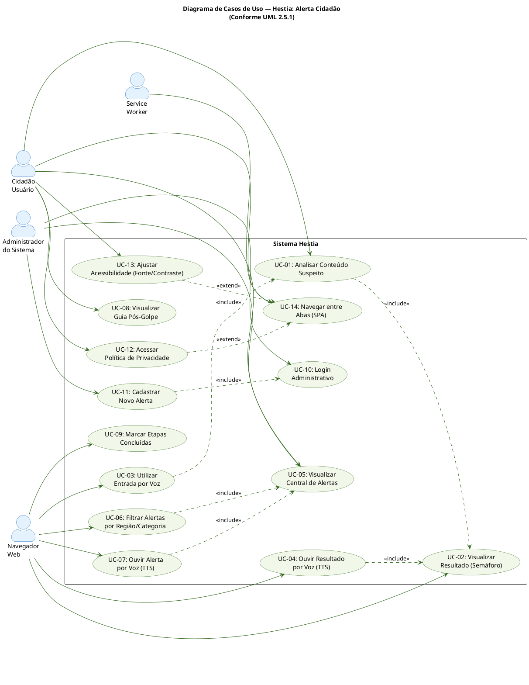
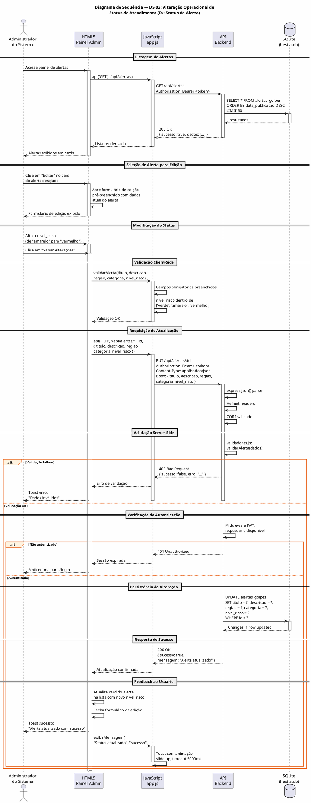

# Requisitos de Usuário — Hestia: Alerta Cidadão

**Versão:** 1.0  
**Data:** 08 de Setembro de 2026  
**Padrões de Referência:** OMG UML 2.5.1, ISO/IEC/IEEE 29148:2018, FURPS+ / ISO/IEC 25010  
**Escopo do Documento:** Perspectiva de negócio, experiência do usuário e critérios funcionais externos

---

## Sumário

1. [Atores do Sistema](#1-atores-do-sistema)
2. [Diagrama de Casos de Uso](#2-diagrama-de-casos-de-uso)
3. [Catálogo de Requisitos de Usuário (RU)](#3-catálogo-de-requisitos-de-usuário-ru)
4. [Histórias de Usuário e Critérios de Aceite](#4-histórias-de-usuário-e-critérios-de-aceite)
5. [Diagramas de Sequência](#5-diagramas-de-sequência)

---

## 1. Atores do Sistema

### 1.1 Taxonomia de Atores (Conforme UML 2.5.1)

A UML 2.5.1 classifica atores em categorias com base em sua relação com o sistema. A seguir, a caracterização completa de cada ator identificado no sistema Hestia.

#### 1.1.1 Atores Humanos Primários

São os atores que iniciam interações diretas com o sistema para atingir objetivos específicos.

| ID | Ator | Descrição | Objetivo Principal | Nível de Expertise |
|----|------|-----------|-------------------|-------------------|
| AH-P01 | **Cidadão Usuário** | Qualquer pessoa física que deseja verificar se um conteúdo (link, mensagem, chave Pix, telefone ou e-mail) é potencialmente fraudulento. Acessa o sistema via navegador web em dispositivo móvel ou desktop. | Submeter conteúdo para análise heurística e obter classificação de risco (semáforo verde/amarelo/vermelho). | Básico — usuários de smartphones e computadores, sem conhecimento técnico em segurança da informação. |
| AH-P02 | **Administrador do Sistema** | Profissional responsável pela gestão operacional do catálogo de alertas de golpes. Acessa o sistema com credenciais autenticadas (login + sessão/token). | Cadastrar, consultar e gerenciar alertas de golpes que alimentam o centro de alertas semanal. | Intermediário — conhecimento de operações de segurança cibernética e gestão de conteúdo. |

#### 1.1.2 Atores Humanos Secundários

São os atores que prestam suporte indireto ao sistema, mas não iniciam interações primárias.

| ID | Ator | Descrição | Objetivo Principal | Nível de Expertise |
|----|------|-----------|-------------------|-------------------|
| AH-S01 | **Especialista em Segurança Cibernética** | Profissional que fornece os dados de entrada (regras heurísticas, listas de domínios suspeitos, códigos DDD, bases de typosquatting) que alimentam o motor de análise. | Manter a base de conhecimento do motor heurístico atualizada e tecnicamente precisa. | Avançado — conhecimento profundo em fraudes digitais, phishing e engenharia social. |

#### 1.1.3 Atores Sistêmicos

São atores não humanos (sistemas externos ou componentes do próprio sistema) que interagem automaticamente.

| ID | Ator | Descrição | Objetivo Principal |
|----|------|-----------|-------------------|
| AS-01 | **Navegador Web (Client-Side)** | O navegador do usuário (Chrome, Firefox, Safari, Edge) que renderiza a interface HTML5, executa JavaScript, gerencia o Service Worker para cache offline e fornece a API Web Speech para entrada/saída de voz. | Renderizar a SPA, executar validação client-side, gerenciar cache PWA e fornecer acessibilidade por voz. |
| AS-02 | **Servidor Node.js (Runtime V8)** | O processo backend que hospeda o Express, processa requisições HTTP, executa o motor heurístico e gerencia a persistência no banco SQLite. | Processar análises, servir a API REST e gerenciar a camada de persistência. |
| AS-03 | **Banco de Dados SQLite** | O motor de persistência relacional que armazena as tabelas `alertas_golpes` e `estatisticas_analise` em modo WAL (Write-Ahead Logging). | Armazenar dados de forma consistente, concorrente e com integridade referencial. |
| AS-04 | **Service Worker (PWA)** | Componente do frontend que intercepta requisições de rede, implementa cache-first para assets estáticos e network-only para chamadas de API (preservando privacidade LGPD). | Disponibilizar funcionamento offline para assets estáticos e garantir que dados analisados nunca sejam persistidos em cache. |

---

### 1.2 Relações de Herança entre Atores

```
                    <<abstract>>
                   HumanoBase
                  /          \
     Cidadão Usuário    Administrador
     (AH-P01)          (AH-P02)
```

- **HumanoBase** (abstrato): define propriedades comuns a todos os atores humanos (nome, autenticação, nível de acesso).
- **Cidadão Usuário** e **Administrador** herdam de HumanoBase e adicionam comportamentos específicos.

### 1.3 Estereótipos de Atores (UML 2.5.1)

| Ator | Estereótipo | Justificativa |
|------|-------------|---------------|
| Cidadão Usuário | `<<primary>>` | Inicia o caso de uso principal (análise de conteúdo). |
| Administrador | `<<primary>>` | Inicia casos de uso administrativos (gestão de alertas). |
| Especialista em Segurança | `<<support>>` | Fornece dados de suporte ao sistema, não interage diretamente com a UI. |
| Navegador Web | `<<system>>` | Componente infraestrutural que executa o código client-side. |
| Servidor Node.js | `<<system>>` | Componente infraestrutural que executa o código server-side. |
| Banco de Dados SQLite | `<<system>>` | Componente de persistência. |
| Service Worker | `<<system>>` | Componente de cache e/offline. |

---

## 2. Diagrama de Casos de Uso

### 2.1 Diagrama de Casos de Uso Principal (PlantUML)



### 2.2 Descrição dos Casos de Uso

#### UC-01: Analisar Conteúdo Suspeito
- **Ator Principal:** Cidadão Usuário
- **Pré-condição:** Usuário acessou a aba "Analisar" do sistema.
- **Fluxo Principal:** O usuário seleciona o tipo de conteúdo (link, texto, Pix, telefone, e-mail), insere o conteúdo na textarea, submete o formulário e recebe a classificação de risco.
- **Pós-condição:** O sistema exibe o resultado do semáforo de risco com detalhes das regras atingidas.
- **Estereótipos:** `<<include>>` por UC-02 (Visualizar Resultado).

#### UC-02: Visualizar Resultado (Semáforo)
- **Ator Principal:** Cidadão Usuário / Administrador
- **Pré-condição:** Uma análise foi submetida com sucesso.
- **Fluxo Principal:** O sistema renderiza o semáforo de risco com cor, símbolo, título, resumo textual e detalhes das regras acionadas.
- **Pós-condição:** O usuário compreende o nível de risco do conteúdo analisado.

#### UC-03: Utilizar Entrada por Voz
- **Ator Principal:** Cidadão Usuário (via Navegador Web)
- **Pré-condição:** O navegador suporta a Web Speech API (SpeechRecognition).
- **Fluxo Principal:** O usuário clica no botão de microfone, fala o conteúdo a ser analisado, o sistema transcreve a fala e preenche automaticamente a textarea.
- **Pós-condição:** O campo de entrada contém o texto transcrito da fala do usuário.
- **Estereótipo:** `<<include>>` por UC-01.
- **Extensão:** UC-03 pode ser estendido por cenários onde o navegador não suporta SpeechRecognition (fallback silencioso).

#### UC-04: Ouvir Resultado por Voz (TTS)
- **Ator Principal:** Cidadão Usuário (via Navegador Web)
- **Pré-condição:** Um resultado de análise está disponível na tela.
- **Fluxo Principal:** O sistema oferece a opção de ler o resultado em voz alta usando a API speechSynthesis do navegador.
- **Pós-condição:** O resultado é lido em voz alta para o usuário.
- **Estereótipo:** `<<include>>` por UC-02.

#### UC-05: Visualizar Central de Alertas
- **Ator Principal:** Cidadão Usuário / Administrador
- **Pré-condição:** Usuário acessou a aba "Alertas".
- **Fluxo Principal:** O sistema busca e exibe os alertas de golpes cadastrados, com título, badge de risco, descrição, região, categoria e data.
- **Pós-condição:** O usuário visualiza a lista de alertas disponíveis.

#### UC-06: Filtrar Alertas por Região/Categoria
- **Ator Principal:** Cidadão Usuário / Administrador (via Navegador Web)
- **Pré-condição:** A aba "Alertas" está ativa com dados carregados.
- **Fluxo Principal:** O usuário seleciona filtros de região e/ou categoria; o sistema re-renderiza a lista de alertas com base nos filtros aplicados.
- **Pós-condição:** A lista de alertas está filtrada conforme os critérios selecionados.
- **Estereótipo:** `<<include>>` por UC-05.

#### UC-07: Ouvir Alerta por Voz (TTS)
- **Ator Principal:** Cidadão Usuário (via Navegador Web)
- **Pré-condição:** Alertas estão sendo exibidos na tela.
- **Fluxo Principal:** O usuário clica no botão de voz de um card de alerta específico; o sistema lê o título e a descrição daquele alerta em voz alta.
- **Pós-condição:** O conteúdo do alerta é lido em voz alta.
- **Estereótipo:** `<<include>>` por UC-05.

#### UC-08: Visualizar Guia Pós-Golpe
- **Ator Principal:** Cidadão Usuário
- **Pré-condição:** Usuário acessou a aba "Guia".
- **Fluxo Principal:** O sistema exibe o passo-a-passo pós-golpe com etapas numeradas, títulos, descrições e checkbox de conclusão.
- **Pós-condição:** O usuário visualiza o guia completo com progresso de conclusão.

#### UC-09: Marcar Etapas Concluídas
- **Ator Principal:** Cidadão Usuário (via Navegador Web)
- **Pré-condição:** O guia pós-golpe está carregado.
- **Fluxo Principal:** O usuário marca o checkbox de uma etapa como concluída; o sistema atualiza o progresso ("X de Y etapas concluídas").
- **Pós-condição:** O progresso do guia é atualizado localmente (state do componente).

#### UC-10: Login Administrativo
- **Ator Principal:** Administrador do Sistema
- **Pré-condição:** O administrador acessa a rota de autenticação.
- **Fluxo Principal:** O administrador insere credenciais (e-mail + senha); o sistema valida, gera sessão/token e redireciona para o painel administrativo.
- **Pós-condição:** A sessão administrativa está autenticada e o administrador pode acessar rotas protegidas.
- **Estereótipo:** `<<include>>` por UC-11.

#### UC-11: Cadastrar Novo Alerta
- **Ator Principal:** Administrador do Sistema
- **Pré-condição:** O administrador está autenticado (sessão ativa via UC-10).
- **Fluxo Principal:** O administrador preenche o formulário de alerta (título, descrição, região, categoria, nível de risco) e submete; o sistema valida os dados, persiste no banco e retorna confirmação.
- **Pós-condição:** O novo alerta está disponível na central de alertas (UC-05).
- **Estereótipo:** `<<include>>` por UC-10.

#### UC-12: Acessar Política de Privacidade
- **Ator Principal:** Cidadão Usuário
- **Pré-condição:** O usuário está em qualquer aba do sistema.
- **Fluxo Principal:** O usuário acessa o rodapé ou link de privacidade; o sistema exibe a política de dados e conformidade LGPD.
- **Pós-condição:** O usuário é informado sobre o tratamento de dados (conteúdo analisado nunca é persistido).
- **Estereótipo:** `<<extend>>` de UC-14.

#### UC-13: Ajustar Acessibilidade (Fonte/Contraste)
- **Ator Principal:** Cidadão Usuário
- **Pré-condição:** O usuário está em qualquer aba do sistema.
- **Fluxo Principal:** O usuário utiliza os controles de acessibilidade no cabeçalho (A-, A+, toggle de alto contraste) para ajustar o tamanho da fonte e o tema visual.
- **Pós-condição:** A interface reflete as preferências de acessibilidade do usuário.
- **Estereótipo:** `<<extend>>` de UC-14.

#### UC-14: Navegar entre Abas (SPA)
- **Ator Principal:** Cidadão Usuário / Administrador
- **Pré-condição:** A aplicação está carregada.
- **Fluxo Principal:** O usuário alterna entre as abas (Analisar, Alertas, Guia, Sobre) usando a barra de navegação inferior.
- **Pós-condição:** A aba selecionada está visível e as demais estão ocultas via atributo `hidden`.

---

## 3. Catálogo de Requisitos de Usuário (RU)

### 3.1 Legenda de Prioridade MoSCoW

| Sigla | Significado | Descrição |
|-------|-------------|-----------|
| **M** | Must Have | Requisito obrigatório para a entrega da solução. Sem ele, o sistema não atende seu objetivo principal. |
| **S** | Should Have | Requisito importante que agrega valor significativo, mas cuja ausência não impede o funcionamento básico. |
| **C** | Could Have | Requisito desejável que melhora a experiência, mas pode ser adiado para futuras versões. |
| **W** | Won't Have (this time) | Requisito explicitamente excluído do escopo atual, documentado para referência futura. |

---

### RU-01: Submissão de Conteúdo para Análise Heurística

| Campo | Descrição |
|-------|-----------|
| **ID** | RU-01 |
| **Caso de Uso** | UC-01 |
| **Ator Principal** | Cidadão Usuário (AH-P01) |
| **Prioridade** | **M** (Must Have) |
| **Pré-condições** | 1. O usuário acessou a aba "Analisar" do sistema.<br>2. O navegador está conectado à internet (primeira carga) ou a aplicação está em cache (PWA offline). |
| **Fluxo Operacional** | 1. O usuário seleciona o tipo de conteúdo no seletor (link, texto, chave Pix, telefone ou e-mail).<br>2. O usuário insere o conteúdo suspeito na textarea (mínimo 3 caracteres, máximo 2000).<br>3. O sistema valida client-side: campo não vazio, comprimento mínimo, formato adequado ao tipo selecionado.<br>4. O usuário clica no botão "Analisar".<br>5. O frontend exibe estado de loading (spinner ou indicador visual).<br>6. O frontend envia `POST /api/analises` com payload `{ tipo, conteudo }`.<br>7. O backend sanitiza a entrada (trim + escape), valida os parâmetros e invoca o motor heurístico.<br>8. O motor heurístico avalia o conteúdo contra as regras do tipo selecionado.<br>9. O backend registra metadados anônimos na tabela `estatisticas_analise` (tipo, risco, regras atingidas — conteúdo nunca é persistido).<br>10. O backend retorna `{ sucesso, risco, regras_atingidas, regras_detalhes, resumo, tempo_ms }`.<br>11. O frontend renderiza o resultado no semáforo de risco. |
| **Pós-condições** | 1. O usuário visualiza a classificação de risco (verde/amarelo/vermelho) com detalhes das regras acionadas.<br>2. Metadados anônimizados são registrados no banco de dados. |

---

### RU-02: Visualização do Resultado via Semáforo de Risco

| Campo | Descrição |
|-------|-----------|
| **ID** | RU-02 |
| **Caso de Uso** | UC-02 |
| **Ator Principal** | Cidadão Usuário (AH-P01) |
| **Prioridade** | **M** (Must Have) |
| **Pré-condições** | 1. Uma análise foi submetida com sucesso via RU-01.<br>2. O backend retornou uma resposta válida. |
| **Fluxo Operacional** | 1. O frontend recebe a resposta da API.<br>2. O sistema renderiza um círculo de 8.5rem com a cor correspondente ao nível de risco.<br>3. Exibe o símbolo textual (✓ para verde, ⚠ para amarelo, ✗ para vermelho).<br>4. Exibe o título do nível de risco ("Baixo Risco", "Risco Moderado", "Alto Risco").<br>5. Exibe o resumo textual com a mensagem amigável.<br>6. Exibe a lista de regras atingidas com ícones e descrições.<br>7. Exibe o tempo de processamento em milissegundos.<br>8. O elemento de resultado possui `aria-live="polite"` para leitores de tela. |
| **Pós-condições** | 1. O usuário compreende visual e textualmente o nível de risco do conteúdo analisado. |

---

### RU-03: Entrada de Conteúdo por Voz (Speech Recognition)

| Campo | Descrição |
|-------|-----------|
| **ID** | RU-03 |
| **Caso de Uso** | UC-03 |
| **Ator Principal** | Cidadão Usuário (AH-P01) via Navegador Web (AS-01) |
| **Prioridade** | **S** (Should Have) |
| **Pré-condições** | 1. O navegador do usuário suporta a Web Speech API (SpeechRecognition).<br>2. O usuário concedeu permissão de microfone ao site. |
| **Fluxo Operacional** | 1. O usuário clica no botão de microfone no formulário de análise.<br>2. O sistema invoca `iniciarEscuta()` do módulo `voz.js`.<br>3. O navegador ativa o microfone e começa a capturar áudio.<br>4. O sistema exibe feedback visual de que está ouvindo (ex: ícone pulsante).<br>5. À medida que o usuário fala, o sistema exibe a transcrição parcial na textarea (`interimResults`).<br>6. Quando o usuário para de falar ou clica para parar, o sistema finaliza a transcrição.<br>7. O texto transcrito é inserido na textarea do formulário.<br>8. O usuário pode editar o texto transcrito antes de submeter. |
| **Pós-condições** | 1. A textarea contém o texto transcrito da fala do usuário.<br>2. O usuário pode prosseguir com a análise (RU-01). |
| **Exceções** | - Se o navegador não suporta SpeechRecognition, o botão de microfone é oculto silenciosamente.<br>- Se o usuário negar a permissão de microfone, o sistema exibe mensagem informativa e desabilita o botão. |

---

### RU-04: Saída de Resultado por Voz (Text-to-Speech)

| Campo | Descrição |
|-------|-----------|
| **ID** | RU-04 |
| **Caso de Uso** | UC-04 |
| **Ator Principal** | Cidadão Usuário (AH-P01) via Navegador Web (AS-01) |
| **Prioridade** | **S** (Should Have) |
| **Pré-condições** | 1. Um resultado de análise está disponível na tela (RU-02 concluída).<br>2. O navegador suporta a API `speechSynthesis`. |
| **Fluxo Operacional** | 1. O sistema detecta que um resultado foi renderizado.<br>2. O módulo `analise.js` invoca `falar(resumo)` do módulo `voz.js`.<br>3. O módulo `voz.js` cria um objeto `SpeechSynthesisUtterance` com o texto do resumo.<br>4. Configura a utterance: idioma `pt-BR`, taxa de fala `0.95`, volume `1.0`.<br>5. O navegador sintetiza e reproduz a fala.<br>6. O usuário pode interromper a fala a qualquer momento. |
| **Pós-condições** | 1. O resultado da análise é lido em voz alta para o usuário. |

---

### RU-05: Visualização da Central de Alertas

| Campo | Descrição |
|-------|-----------|
| **ID** | RU-05 |
| **Caso de Uso** | UC-05 |
| **Ator Principal** | Cidadão Usuário (AH-P01) / Administrador (AH-P02) |
| **Prioridade** | **M** (Must Have) |
| **Pré-condições** | 1. O usuário acessou a aba "Alertas". |
| **Fluxo Operacional** | 1. O frontend envia `GET /api/alertas`.<br>2. O backend consulta a tabela `alertas_golpes` com `LIMIT 50`.<br>3. O backend retorna `{ sucesso, dados: [...] }`.<br>4. O frontend renderiza cards de alerta com: título, badge de risco (cor + texto), descrição, região, categoria e data de publicação.<br>5. Cada card possui um botão de voz para ouvir o alerta (TTS). |
| **Pós-condições** | 1. O usuário visualiza a lista de alertas de golpes disponíveis. |

---

### RU-06: Filtragem de Alertas por Região e/ou Categoria

| Campo | Descrição |
|-------|-----------|
| **ID** | RU-06 |
| **Caso de Uso** | UC-06 |
| **Ator Principal** | Cidadão Usuário (AH-P01) via Navegador Web (AS-01) |
| **Prioridade** | **S** (Should Have) |
| **Pré-condições** | 1. A aba "Alertas" está ativa com dados já carregados (RU-05). |
| **Fluxo Operacional** | 1. O frontend extrai as regiões e categorias únicas dos alertas retornados.<br>2. Popula os dropdowns de filtro "Região" e "Categoria" com as opções disponíveis.<br>3. O usuário seleciona uma ou ambas as opções de filtro.<br>4. O frontend re-renderiza a lista de alertas com base nos filtros aplicados (filtragem client-side).<br>5. Se nenhum filtro estiver selecionado, todos os alertas são exibidos. |
| **Pós-condições** | 1. A lista de alertas está filtrada conforme os critérios do usuário. |

---

### RU-07: Leitura de Alerta por Voz (TTS)

| Campo | Descrição |
|-------|-----------|
| **ID** | RU-07 |
| **Caso de Uso** | UC-07 |
| **Ator Principal** | Cidadão Usuário (AH-P01) via Navegador Web (AS-01) |
| **Prioridade** | **C** (Could Have) |
| **Pré-condições** | 1. Alertas estão sendo exibidos na tela (RU-05).<br>2. O navegador suporta `speechSynthesis`. |
| **Fluxo Operacional** | 1. O usuário clica no botão de voz de um card de alerta específico.<br>2. O módulo `alertas.js` invoca `falar(titulo + " " + descricao)` do módulo `voz.js`.<br>3. O navegador lê o conteúdo do alerta em voz alta.<br>4. O usuário pode interromper a fala a qualquer momento. |
| **Pós-condições** | 1. O conteúdo do alerta selecionado é lido em voz alta. |

---

### RU-08: Visualização do Guia Pós-Golpe

| Campo | Descrição |
|-------|-----------|
| **ID** | RU-08 |
| **Caso de Uso** | UC-08 |
| **Ator Principal** | Cidadão Usuário (AH-P01) |
| **Prioridade** | **M** (Must Have) |
| **Pré-condições** | 1. O usuário acessou a aba "Guia". |
| **Fluxo Operacional** | 1. O frontend envia `GET /api/guia`.<br>2. O backend retorna os dados estáticos da lista `guiaPosGolpe` do módulo `listaGolpes.js`.<br>3. O frontend renderiza as etapas numeradas com: número da etapa, título, descrição e checkbox de conclusão.<br>4. Exibe o progresso "X de Y etapas concluídas".<br>5. Quando todas as etapas são marcadas, exibe mensagem de conclusão. |
| **Pós-condições** | 1. O usuário visualiza o guia completo de ações pós-golpe.<br>2. O progresso é mantido localmente (state do componente). |

---

### RU-09: Marcação de Etapas Concluídas no Guia

| Campo | Descrição |
|-------|-----------|
| **ID** | RU-09 |
| **Caso de Uso** | UC-09 |
| **Ator Principal** | Cidadão Usuário (AH-P01) via Navegador Web (AS-01) |
| **Prioridade** | **C** (Could Have) |
| **Pré-condições** | 1. O guia pós-golpe está carregado (RU-08). |
| **Fluxo Operacional** | 1. O usuário marca o checkbox de uma etapa como concluída.<br>2. O módulo `guia.js` atualiza o estado local da etapa para `concluida = true`.<br>3. O frontend re-renderiza a contagem de progresso.<br>4. Se todas as etapas estiverem concluídas, exibe mensagem de conclusão com ícone de confete. |
| **Pós-condições** | 1. O progresso é atualizado visualmente (persistência apenas no state do componente). |

---

### RU-10: Autenticação Administrativa (Login)

| Campo | Descrição |
|-------|-----------|
| **ID** | RU-10 |
| **Caso de Uso** | UC-10 |
| **Ator Principal** | Administrador do Sistema (AH-P02) |
| **Prioridade** | **M** (Must Have) |
| **Pré-condições** | 1. O administrador acessou a rota de autenticação (`/login` ou equivalente). |
| **Fluxo Operacional** | 1. O administrador insere o endereço de e-mail.<br>2. O administrador insere a senha.<br>3. O frontend envia `POST /api/auth/login` com payload `{ email, senha }`.<br>4. O backend valida as credenciais contra o banco de dados.<br>5. Se válidas, gera um JSON Web Token (JWT) com tempo de expiração.<br>6. O backend retorna `{ sucesso, token, usuario: { id, nome, email, perfil } }`.<br>7. O frontend armazena o token em `localStorage` ou cookie HTTP-Only.<br>8. O frontend redireciona para o painel administrativo. |
| **Pós-condições** | 1. A sessão administrativa está autenticada.<br>2. Requisições subsequentes incluem o cabeçalho `Authorization: Bearer <token>`. |

---

### RU-11: Cadastro de Alerta de Golpe (Administrativo)

| Campo | Descrição |
|-------|-----------|
| **ID** | RU-11 |
| **Caso de Uso** | UC-11 |
| **Ator Principal** | Administrador do Sistema (AH-P02) |
| **Prioridade** | **M** (Must Have) |
| **Pré-condições** | 1. O administrador está autenticado (RU-10 concluída).<br>2. O administrador acessou o formulário de cadastro de alerta. |
| **Fluxo Operacional** | 1. O administrador preenche os campos: título (obrigatório), descrição (obrigatória), região (obrigatória), categoria (obrigatória), nível de risco (obrigatório: verde/amarelo/vermelho).<br>2. O frontend valida client-side: campos não vazios, comprimentos máximos, valor de `nivel_risco` dentro da enum.<br>3. O frontend envia `POST /api/alertas` com payload `{ titulo, descricao, regiao, categoria, nivel_risco }` e cabeçalho `Authorization: Bearer <token>`.<br>4. O backend valida os dados via `validadores.js` (trim, escape, comprimentos).<br>5. O backend insere o registro na tabela `alertas_golpes`.<br>6. O backend retorna `{ sucesso, mensagem: "Alerta cadastrado com sucesso" }`.<br>7. O frontend exibe toast de confirmação e redireciona para a lista de alertas. |
| **Pós-condições** | 1. O novo alerta está disponível na central de alertas para todos os usuários.<br>2. O registro contém `data_publicacao` com a data/hora atual. |

---

### RU-12: Acessibilidade — Ajuste de Tamanho de Fonte

| Campo | Descrição |
|-------|-----------|
| **ID** | RU-12 |
| **Caso de Uso** | UC-13 |
| **Ator Principal** | Cidadão Usuário (AH-P01) |
| **Prioridade** | **S** (Should Have) |
| **Pré-condições** | 1. A aplicação está carregada. |
| **Fluxo Operacional** | 1. O usuário clica no botão "A+" no cabeçalho.<br>2. O sistema alterna entre três tamanhos de fonte: normal (100% / 18px), grande (112.5%) e extra (125%).<br>3. A preferência é persistida no `localStorage` do navegador.<br>4. Na próxima visita, a preferência de fonte é restaurada automaticamente. |
| **Pós-condições** | 1. O tamanho da fonte é ajustado conforme a preferência do usuário.<br>2. A preferência é persistida entre sessões. |

---

### RU-13: Acessibilidade — Alto Contraste

| Campo | Descrição |
|-------|-----------|
| **ID** | RU-13 |
| **Caso de Uso** | UC-13 |
| **Ator Principal** | Cidadão Usuário (AH-P01) |
| **Prioridade** | **S** (Should Have) |
| **Pré-condições** | 1. A aplicação está carregada. |
| **Fluxo Operacional** | 1. O usuário clica no botão de toggle de alto contraste no cabeçalho.<br>2. O sistema alterna o atributo `data-tema` do elemento raiz para `"alto-contraste"`.<br>3. O CSS aplica o tema de alto contraste: fundo preto (#000000), texto branco (#FFFFFF), acentos amarelos (#FFD600).<br>4. A preferência é persistida no `localStorage` do navegador. |
| **Pós-condições** | 1. A interface é renderizada em alto contraste para usuários com baixa visão. |

---

### RU-14: Navegação entre Abas (SPA)

| Campo | Descrição |
|-------|-----------|
| **ID** | RU-14 |
| **Caso de Uso** | UC-14 |
| **Ator Principal** | Cidadão Usuário (AH-P01) / Administrador (AH-P02) |
| **Prioridade** | **M** (Must Have) |
| **Pré-condições** | 1. A aplicação está carregada. |
| **Fluxo Operacional** | 1. O usuário clica em uma das abas na barra de navegação inferior (Analisar, Alertas, Guia, Sobre).<br>2. O módulo `app.js` remove a classe `ativa` de todas as abas e a adiciona na aba clicada.<br>3. Alterna a visibilidade das seções usando o atributo `hidden`.<br>4. Ao trocar de aba, o sistema interrompe qualquer fala em andamento (Speech Synthesis).<br>5. O aria-selected da aba ativa é atualizado para `true`. |
| **Pós-condições** | 1. A aba selecionada está visível.<br>2. As demais abas estão ocultas. |

---

### RU-15: Acessibilidade por Voz — Entrada de Fala

| Campo | Descrição |
|-------|-----------|
| **ID** | RU-15 |
| **Caso de Uso** | UC-03 |
| **Ator Principal** | Cidadão Usuário (AH-P01) via Navegador Web (AS-01) |
| **Prioridade** | **S** (Should Have) |
| **Pré-condições** | 1. O navegador suporta Web Speech API.<br>2. O usuário concedeu permissão de microfone. |
| **Fluxo Operacional** | 1. O usuário clica no botão de microfone no formulário de análise ou em qualquer campo que suporte entrada por voz.<br>2. O sistema ativa o reconhecimento de fala em Português Brasileiro (`pt-BR`).<br>3. O texto transcrito é inserido no campo correspondente.<br>4. O usuário pode editar o texto transcrito. |
| **Pós-condições** | 1. O campo de entrada contém o texto transcrito. |

---

### RU-16: Conformidade com LGPD (Privacidade)

| Campo | Descrição |
|-------|-----------|
| **ID** | RU-16 |
| **Caso de Uso** | UC-01, UC-12 |
| **Ator Principal** | Cidadão Usuário (AH-P01) |
| **Prioridade** | **M** (Must Have) |
| **Pré-condições** | 1. O sistema está operacional. |
| **Fluxo Operacional** | 1. O conteúdo submetido para análise (link, texto, Pix, telefone, e-mail) é processado inteiramente em memória.<br>2. O conteúdo NUNCA é persistido no banco de dados.<br>3. Apenas metadados anônimos são registrados: tipo de entrada, nível de risco e regras atingidas (nomes das regras como string separada por vírgulas).<br>4. O Service Worker NÃO armazena em cache chamadas de API (network-only).<br>5. O rodapé da aplicação exibe aviso de privacidade e conformidade LGPD. |
| **Pós-condições** | 1. Nenhum conteúdo analisado é armazenado permanentemente.<br>2. O sistema atende aos requisitos da Lei Geral de Proteção de Dados. |

---

## 4. Histórias de Usuário e Critérios de Aceite

### HU-01: Submissão e Análise de Conteúdo

**Como** cidadão usuário,  
**quero** submeter um conteúdo suspeito (link, mensagem, chave Pix, telefone ou e-mail) para análise,  
**para que** eu possa saber rapidamente se o conteúdo apresenta risco de golpe.

#### Critérios de Aceite (BDD / Gherkin)

```gherkin
Funcionalidade: Análise de Conteúdo Suspeito
  Como cidadão usuário
  Eu quero submeter conteúdo para análise heurística
  Para classificar o nível de risco de possíveis golpes

  Cenário: Análise bem-sucedida de link suspeito
    Dado que o usuário está na aba "Analisar"
    Quando o usuário seleciona o tipo "link"
    E insere o conteúdo "http://bit.ly/3xFakeBank"
    E clica no botão "Analisar"
    Então o sistema deve enviar POST /api/analises com tipo "link"
    E exibir o semáforo de risco com a cor correspondente
    E exibir pelo menos uma regra atingida

  Cenário: Rejeição de conteúdo com menos de 3 caracteres
    Dado que o usuário está na aba "Analisar"
    Quando o usuário seleciona o tipo "texto"
    E insere o conteúdo "ab"
    E clica no botão "Analisar"
    Então o sistema deve exibir mensagem de erro "Mínimo de 3 caracteres"
    E NÃO deve enviar requisição à API

  Cenário: Rejeição de conteúdo vazio
    Dado que o usuário está na aba "Analisar"
    Quando o usuário seleciona o tipo "link"
    E NÃO insere nenhum conteúdo
    E clica no botão "Analisar"
    Então o sistema deve exibir mensagem de erro "Campo obrigatório"
    E NÃO deve enviar requisição à API

  Cenário: Feedback visual durante processamento
    Dado que o usuário submeteu um conteúdo para análise
    Quando a requisição está em andamento
    Então o sistema deve exibir indicador de loading
    E o botão "Analisar" deve estar desabilitado
```

---

### HU-02: Visualização do Resultado via Semáforo

**Como** cidadão usuário,  
**quero** visualizar o resultado da análise em um semáforo de cores (verde, amarelo, vermelho),  
**para que** eu compreenda rapidamente o nível de risco.

#### Critérios de Aceite (BDD / Gherkin)

```gherkin
Funcionalidade: Visualização do Semáforo de Risco
  Como cidadão usuário
  Eu quero ver o resultado em semáforo de cores
  Para entender rapidamente o nível de risco

  Cenário: Exibição de risco baixo (verde)
    Dado que o backend retornou risco "verde"
    Quando o frontend renderiza o resultado
    Então o círculo deve ter cor verde (#4CAF50)
    E o símbolo deve ser "✓"
    E o título deve ser "Baixo Risco"

  Cenário: Exibição de risco moderado (amarelo)
    Dado que o backend retornou risco "amarelo"
    Quando o frontend renderiza o resultado
    Então o círculo deve ter cor amarelo (#FFC107)
    E o símbolo deve ser "⚠"
    E o título deve ser "Risco Moderado"

  Cenário: Exibição de risco alto (vermelho)
    Dado que o backend retornou risco "vermelho"
    Quando o frontend renderiza o resultado
    Então o círculo deve ter cor vermelho (#F44336)
    E o símbolo deve ser "✗"
    E o título deve ser "Alto Risco"

  Cenário: Acessibilidade do resultado
    Dado que um resultado foi renderizado
    Quando o elemento de resultado está no DOM
    Então o atributo aria-live deve ser "polite"
    E o leitor de tela deve anunciar o nível de risco
```

---

### HU-03: Entrada por Voz

**Como** cidadão usuário com limitações de digitação,  
**quero** usar minha voz para inserir o conteúdo a ser analisado,  
**para que** eu possa utilizar o sistema de forma acessível.

#### Critérios de Aceite (BDD / Gherkin)

```gherkin
Funcionalidade: Entrada de Conteúdo por Voz
  Como cidadão usuário
  Eu quero falar o conteúdo para análise
  Para acessar o sistema sem digitar

  Cenário: Transcrição bem-sucedida da fala
    Dado que o navegador suporta SpeechRecognition
    E o usuário concedeu permissão de microfone
    Quando o usuário clica no botão de microfone
    E fala "link ponto com barra barra假银行"
    Então a textarea deve conter o texto transcrito
    E o usuário deve poder editar o texto antes de submeter

  Cenário: Navegador sem suporte a SpeechRecognition
    Dado que o navegador NÃO suporta SpeechRecognition
    Quando o formulário de análise é exibido
    Então o botão de microfone NÃO deve ser exibido
    E a entrada por texto deve funcionar normalmente

  Cenário: Permissão de microfone negada
    Dado que o navegador suporta SpeechRecognition
    Quando o usuário nega a permissão de microfone
    Então o sistema deve exibir mensagem informativa
    E o botão de microfone deve ser desabilitado
```

---

### HU-04: Saída por Voz (TTS)

**Como** cidadão usuário com deficiência visual,  
**quero** ouvir o resultado da análise em voz alta,  
**para que** eu compreenda o risco sem depender da visão.

#### Critérios de Aceite (BDD / Gherkin)

```gherkin
Funcionalidade: Leitura do Resultado por Voz
  Como cidadão usuário
  Eu quero ouvir o resultado da análise
  Para acessar o resultado sem depender da visão

  Cenário: Leitura automática do resumo
    Dado que um resultado de análise foi renderizado
    Quando o semáforo é exibido na tela
    Então o sistema deve ler o resumo em voz alta
    E a língua deve ser pt-BR
    E a taxa de fala deve ser 0.95

  Cenário: Interrupção da fala
    Dado que o resultado está sendo lido em voz alta
    Quando o usuário navega para outra aba
    Então a fala deve ser interrompida imediatamente

  Cenário: Navegador sem suporte a speechSynthesis
    Dado que o navegador NÃO suporta speechSynthesis
    Quando um resultado é renderizado
    Então o sistema NÃO deve tentar ler em voz alta
    E o resultado deve ser exibido apenas visualmente
```

---

### HU-05: Visualização e Filtragem de Alertas

**Como** cidadão usuário,  
**quero** visualizar a central de alertas e filtrar por região ou categoria,  
**para que** eu encontre alertas relevantes à minha localização.

#### Critérios de Aceite (BDD / Gherkin)

```gherkin
Funcionalidade: Central de Alertas
  Como cidadão usuário
  Eu quero visualizar alertas de golpes
  Para me manter informado sobre ameaças

  Cenário: Carregamento da lista de alertas
    Dado que o usuário acessou a aba "Alertas"
    Quando a aba é carregada
    Então o frontend deve enviar GET /api/alertas
    E exibir os alertas retornados em cards
    E cada card deve conter: título, badge de risco, descrição, região, categoria e data

  Cenário: Filtragem por região
    Dado que alertas estão sendo exibidos
    Quando o usuário seleciona a região "Centro-Oeste"
    Então apenas alertas da região "Centro-Oeste" devem ser exibidos

  Cenário: Filtragem por categoria
    Dado que alertas estão sendo exibidos
    Quando o usuário seleciona a categoria "Financeiro"
    Então apenas alertas da categoria "Financeiro" devem ser exibidos

  Cenário: Filtragem combinada
    Dado que alertas estão sendo exibidos
    Quando o usuário seleciona região "Sudeste" E categoria "Digital"
    Então apenas alertas que atendem AMBOS os critérios devem ser exibidos

  Cenário: Leitura de alerta por voz
    Dado que alertas estão sendo exibidos
    Quando o usuário clica no botão de voz de um card
    Então o título e a descrição do alerta devem ser lidos em voz alta
```

---

### HU-06: Guia Pós-Golpe

**Como** cidadão vítima de golpe,  
**quero** acessar um guia passo-a-passo com as ações a serem tomadas,  
**para que** eu saiba exatamente o que fazer após ser vítimado.

#### Critérios de Aceite (BDD / Gherkin)

```gherkin
Funcionalidade: Guia Pós-Golpe
  Como cidadão vítima de golpe
  Eu quero um guia de ações pós-golpe
  Para saber os passos a seguir

  Cenário: Exibição do guia completo
    Dado que o usuário acessou a aba "Guia"
    Quando a aba é carregada
    Então o frontend deve enviar GET /api/guia
    E exibir as etapas numeradas com título e descrição
    E exibir checkbox de conclusão para cada etapa
    E exibir progresso "X de Y etapas concluídas"

  Cenário: Marcação de etapa como concluída
    Dado que o guia está carregado com 6 etapas
    Quando o usuário marca o checkbox da etapa 1
    Então o progresso deve atualizar para "1 de 6 etapas concluídas"

  Cenário: Conclusão de todas as etapas
    Dado que o guia está carregado com 6 etapas
    Quando o usuário marca todas as 6 etapas
    Então o sistema deve exibir mensagem de conclusão
    E a mensagem deve conter "Todas as etapas concluídas"

  Cenário: Leitura de etapa por voz
    Dado que o guia está carregado
    Quando o usuário clica no botão de voz de uma etapa
    Então o título e a descrição da etapa devem ser lidos em voz alta
```

---

### HU-07: Autenticação Administrativa

**Como** administrador do sistema,  
**quero** fazer login com minhas credenciais,  
**para que** eu possa acessar o painel de gerenciamento de alertas.

#### Critérios de Aceite (BDD / Gherkin)

```gherkin
Funcionalidade: Login Administrativo
  Como administrador do sistema
  Eu quero autenticar-me para acessar funções administrativas

  Cenário: Login bem-sucedido
    Dado que o administrador está na página de login
    Quando insere email "admin@hestia.gov.br" e senha válida
    E clica em "Entrar"
    Então o sistema deve enviar POST /api/auth/login
    E retornar um token JWT válido
    E redirecionar para o painel administrativo

  Cenário: Login com credenciais inválidas
    Dado que o administrador está na página de login
    Quando insere email "admin@hestia.gov.br" e senha incorreta
    E clica em "Entrar"
    Então o sistema deve exibir mensagem de erro "Credenciais inválidas"
    E NÃO deve redirecionar

  Cenário: Tentativa de acesso sem autenticação
    Dado que o administrador NÃO está autenticado
    Quando tenta acessar /api/alertas (POST)
    Então o sistema deve retornar status 401 Unauthorized
    E redirecionar para a página de login
```

---

### HU-08: Cadastro de Alerta (Administrativo)

**Como** administrador do sistema,  
**quero** cadastrar novos alertas de golpes,  
**para que** a central de alertas permaneça atualizada.

#### Critérios de Aceite (BDD / Gherkin)

```gherkin
Funcionalidade: Cadastro de Alerta
  Como administrador autenticado
  Eu quero cadastrar novos alertas
  Para manter a central de alertas atualizada

  Cenário: Cadastro bem-sucedido
    Dado que o administrador está autenticado
    Quando preenche: título "Golpe Pix Falso", descrição "Golpista finge ser banco...", região "Sudeste", categoria "Financeiro", nível_risco "vermelho"
    E clica em "Cadastrar"
    Então o sistema deve enviar POST /api/alertas com Authorization header
    E retornar sucesso
    E o alerta deve aparecer na central de alertas

  Cenário: Cadastro com campos obrigatórios faltando
    Dado que o administrador está autenticado
    Quando preenche apenas o título
    E clica em "Cadastrar"
    Então o sistema deve exibir erro de validação
    E NÃO deve enviar requisição à API

  Cenário: Cadastro com nível de risco inválido
    Dado que o administrador está autenticado
    Quando seleciona nível_risco "laranja" (valor inválido)
    E clica em "Cadastrar"
    Então o sistema deve exibir erro de validação
    E NÃO deve enviar requisição à API
```

---

### HU-09: Acessibilidade e Preferências

**Como** cidadão usuário com necessidades especiais,  
**quero** ajustar o tamanho da fonte e ativar alto contraste,  
**para que** eu possa ler o conteúdo com conforto.

#### Critérios de Aceite (BDD / Gherkin)

```gherkin
Funcionalidade: Acessibilidade
  Como cidadão usuário
  Eu quero ajustar fonte e contraste
  Para acessar o sistema com conforto

  Cenário: Aumento de fonte
    Dado que a aplicação está carregada com fonte normal
    Quando o usuário clica em "A+"
    Então a fonte deve aumentar para 112.5%
    E a preferência deve ser salva no localStorage

  Cenário: Toggle de alto contraste
    Dado que a aplicação está com tema padrão
    Quando o usuário ativa alto contraste
    Então o fundo deve ficar preto
    E o texto deve ficar branco
    E os acentos devem ficar amarelos
    E a preferência deve ser salva no localStorage

  Cenário: Restauração de preferências
    Dado que o usuário configurou fonte "grande" e alto contraste
    Quando o navegador recarrega a página
    Então a fonte deve ser restaurada para "grande"
    E o alto contraste deve permanecer ativo

  Cenário: Respeito a prefers-reduced-motion
    Dado que o sistema operacional do usuário tem "reduzir movimento" ativo
    Quando a aplicação é carregada
    Então todas as animações devem ser desativadas
```

---

### HU-10: Navegação SPA e Fallback Offline

**Como** cidadão usuário,  
**quero** navegar entre abas e ter acesso offline aos assets,  
**para que** eu possa usar o sistema mesmo sem conexão intermitente.

#### Critérios de Aceite (BDD / Gherkin)

```gherkin
Funcionalidade: Navegação SPA e PWA
  Como cidadão usuário
  Eu quero navegar entre abas e ter cache offline
  Para usar o sistema em qualquer condição de rede

  Cenário: Troca de aba
    Dado que o usuário está na aba "Analisar"
    Quando clica na aba "Alertas"
    Então a aba "Analisar" deve ser ocultada
    E a aba "Alertas" deve ser exibida
    E qualquer fala em andamento deve ser interrompida

  Cenário: Cache de assets estáticos
    Dado que o Service Worker está registrado
    Quando o usuário carrega a página pela primeira vez
    Então os assets (HTML, CSS, JS, ícone, manifest) devem ser cacheados
    E em visitas subsequentes, os assets devem ser servidos do cache

  Cenário: NÃO cache de chamadas de API
    Dado que o Service Worker está ativo
    Quando o frontend faz GET /api/alertas
    Then a requisição NÃO deve ser cacheada
    E a requisição deve ir diretamente à rede

  Cenário: Fallback offline
    Dado que o usuário está offline
    Quando tenta acessar a aplicação
    Then o Service Worker deve servir o index.html do cache
    E a aplicação deve carregar com os assets em cache
```

---

## 5. Diagramas de Sequência

### 5.1 DS-01: Formulário Público com Validação Client-Side e Sanitização

```plantuml
@startuml DS_Formulario_Publico
skinparam backgroundColor #FEFEFE
skinparam sequenceArrowThickness 2
skinparam sequenceLifeLineBorderColor #666666
skinparam sequenceGroupBorderColor #33691E
skinparam sequenceGroupBackgroundColor #F1F8E9

title Diagrama de Sequência — DS-01: Formulário Público de Análise\n(Validação Client-Side, Sanitização Assíncrona e Feedback via Toast/DOM)

actor "Cidadão\nUsuário" as User
participant "HTML5\nFormulário" as Form
participant "JavaScript\nanalisador.js" as JS
participant "JavaScript\napp.js" as App
participant "API\nBackend" as API
database "SQLite\n(hestia.db)" as DB

== Submissão do Formulário ==

User -> Form : Seleciona tipo de conteúdo\n(link/texto/pix/telefone/email)
activate Form
Form --> User : Dropdown atualizado

User -> Form : Insere conteúdo na textarea\n(mín. 3, máx. 2000 caracteres)
activate Form
Form --> User : Conteúdo exibido na textarea

User -> Form : Clica no botão "Analisar"
activate Form

== Validação Client-Side ==

Form -> JS : validarFormulario(tipo, conteudo)
activate JS

JS -> JS : Verifica campos obrigatórios
JS -> JS : Verifica comprimento\n(conteudo.length >= 3 && <= 2000)
JS -> JS : Verifica tipo whitelist\n[link, texto, pix, telefone, email]

alt Validação falhou
  JS --> Form : Erro: "Mínimo 3 caracteres"\nou "Campo obrigatório"
  Form --> User : Exibe mensagem de erro\nem vermelho abaixo do campo
  deactivate JS
  deactivate Form
else Validação bem-sucedida
  JS --> Form : Validação OK
  deactivate JS

  == Sanitização ==

  Form -> JS : sanitizarConteudo(conteudo)
  activate JS
  JS -> JS : trim(conteudo)\nremove espaços extras
  JS -> JS : escape(conteudo)\nprevine XSS via HTML entities
  JS --> Form : conteudoSanitizado
  deactivate JS

  == Indicador de Loading ==

  Form -> Form : Desabilita botão "Analisar"
  Form -> Form : Exibe spinner/indicador\nde carregamento
  Form --> User : Botão desabilitado +\nloading visível

  == Requisição HTTP ==

  Form -> App : api('POST', '/api/analises',\n{ tipo, conteudo: conteudoSanitizado })
  activate App

  App -> API : POST /api/analises\nContent-Type: application/json\nBody: { tipo, conteudo }
  activate API

  API -> API : express.json() parse\n(limit: 10kb)
  API -> API : Helmet headers aplicados
  API -> API : CORS validado

  == Validação Server-Side ==

  API -> API : validadores.js:\nvalidarAnalise(tipo, conteudo)
  API -> API : Trim + Escape adicional

  alt Validação server-side falhou
    API --> App : 400 Bad Request\n{ sucesso: false, erro: "..." }
    App --> Form : Erro de validação
    Form --> User : Toast erro:\n"Dados inválidos"
    deactivate API
    deactivate App
    Form -> Form : Reabilita botão\nRemove loading
  else Validação OK

    == Motor Heurístico ==

    API -> API : analisadorGolpes.js:\nanalisar(conteudo, tipo)
    activate API

    alt tipo == "link"
      API -> API : avaliarLink(url)\n[shorteners, TLDs, HTTPS,\nimpersonação de marca]
    else tipo == "texto"
      API -> API : avaliarTexto(texto)\n[palavras risco, CAPS,\nexclamações, URLs embutidas]
    else tipo == "pix"
      API -> API : avaliarPix(conteudo)\n[formato chave, instruções\nsuspensas]
    else tipo == "telefone"
      API -> API : avaliarTelefone(telefone)\n[DDD, normalização, tipo,\nrepetição, flags contextuais]
    else tipo == "email"
      API -> API : avaliarEmail(email)\n[sintaxe, domínio,\ntyposquatting, padrão local]
    end

    API -> API : Classifica risco:\n[0-1]=verde, [2-3]=amarelo, [4+]=vermelho
    API -> API : Gera resumo textual
    API -> API : Calcula tempo_ms

    deactivate API

    == Persistência de Metadados Anônimos ==

    API -> DB : INSERT INTO estatisticas_analise\n(tipo_entrada, risco, regras_atingidas)
    activate DB
    DB --> API : OK (WAL mode)
    deactivate DB

    == Resposta ==

    API --> App : 200 OK\n{ sucesso: true, risco, regras_atingidas,\nregras_detalhes, resumo, tempo_ms }
    deactivate API

    App --> Form : Dados da resposta
    deactivate App

    == Renderização do Resultado ==

    Form -> Form : Remove indicador de loading
    Form -> Form : Reabilita botão "Analisar"
    Form -> Form : Limpa resultado anterior

    Form -> Form : Renderiza semáforo:\n- Cria círculo 8.5rem\n- Aplica cor (verde/amarelo/vermelho)\n- Adiciona símbolo (✓/⚠/✗)\n- Define aria-live="polite"

    Form -> Form : Renderiza título do risco
    Form -> Form : Renderiza resumo textual
    Form -> Form : Renderiza lista de regras\natingidas com ícones
    Form -> Form : Renderiza tempo_ms

    Form --> User : Resultado completo\nexibido na tela

    == Feedback por Voz (TTS) ==

    opt Navigator.speechSynthesis disponível
      Form -> App : falar(resumo)
      activate App
      App -> App : SpeechSynthesisUtterance\n(lang: pt-BR, rate: 0.95)
      App -> App : speechSynthesis.speak(utterance)
      App --> Form : Fala iniciada
      deactivate App
    end

    == Toast de Confirmação ==

    Form -> App : exibirMensagem("Análise concluída", "sucesso")
    activate App
    App -> App : Cria elemento toast\nTipo: sucesso
    App -> App : Adiciona ao DOM\nanimação slide-up
    App -> App : setTimeout 5000ms\nremove toast
    App --> Form : Toast exibido
    deactivate App

  end
end

deactivate Form

@enduml
```



---

### 5.2 DS-02: Fluxo de Login Administrativo com Sessão/Token

```plantuml
@startuml DS_Login_Administrativo
skinparam backgroundColor #FEFEFE
skinparam sequenceArrowThickness 2
skinparam sequenceLifeLineBorderColor #666666
skinparam sequenceGroupBorderColor #1565C0
skinparam sequenceGroupBackgroundColor #E3F2FD

title Diagrama de Sequência — DS-02: Fluxo de Login Administrativo\n(Sessão/Token JWT e Redirecionamento)

actor "Administrador\ndo Sistema" as Admin
participant "HTML5\nFormulário Login" as Form
participant "JavaScript\napp.js" as App
participant "API\nBackend" as API
participant "Middleware\nAuth" as Auth
database "SQLite\n(hestia.db)" as DB

== Exibição do Formulário ==

Admin -> Form : Acessa rota /login
activate Form
Form --> Admin : Formulário de login\n(email + senha + botão "Entrar")
deactivate Form

== Preenchimento e Submissão ==

Admin -> Form : Insere email\n"admin@hestia.gov.br"
Admin -> Form : Insere senha
Admin -> Form : Clica em "Entrar"
activate Form

== Validação Client-Side ==

Form -> App : validarLogin(email, senha)
activate App
App -> App : Verifica formato email\n(expressão regular)
App -> App : Verifica senha não vazia
App --> Form : Validação OK
deactivate App

== Indicador de Loading ==

Form -> Form : Desabilita botão "Entrar"
Form -> Form : Exibe spinner

== Requisição de Autenticação ==

Form -> App : api('POST', '/api/auth/login',\n{ email, senha })
activate App

App -> API : POST /api/auth/login\nContent-Type: application/json\nBody: { email, senha }
activate API

API -> API : express.json() parse\n(limit: 10kb)
API -> API : Helmet headers
API -> API : CORS validado

== Validação Server-Side ==

API -> API : validarEmail(email)
API -> API : validarSenha(senha)\n(comprimento mínimo, complexidade)

alt Validação falhou
  API --> App : 400 Bad Request\n{ sucesso: false, erro: "Dados inválidos" }
  App --> Form : Erro de validação
  Form --> Admin : Toast erro:\n"Preencha todos os campos corretamente"
  Form -> Form : Reabilita botão
  deactivate API
  deactivate App
else Validação OK

  == Busca de Usuário ==

  API -> DB : SELECT id, nome, email, senha_hash, perfil\nFROM usuarios WHERE email = ?
  activate DB
  DB --> API : resultado (0 ou 1 row)
  deactivate DB

  alt Usuário não encontrado
    API --> App : 401 Unauthorized\n{ sucesso: false, erro: "Credenciais inválidas" }
    App --> Form : Erro de autenticação
    Form --> Admin : Toast erro:\n"Credenciais inválidas"
    Form -> Form : Reabilita botão
    deactivate API
    deactivate App
  else Usuário encontrado

    == Verificação de Senha ==

    API -> API : bcrypt.compare(senha, senha_hash)
    activate API

    alt Senha incorreta
      API --> App : 401 Unauthorized\n{ sucesso: false, erro: "Credenciais inválidas" }
      App --> Form : Erro de autenticação
      Form --> Admin : Toast erro:\n"Credenciais inválidas"
      Form -> Form : Reabilita botão
      deactivate API
      deactivate App
    else Senha correta

      == Geração do Token JWT ==

      API -> API : jwt.sign(\n{ id, nome, email, perfil },\nprocess.env.JWT_SECRET,\n{ expiresIn: '24h' }\n)
      API -> API : Token gerado com\ntempo de expiração 24h

      == Resposta de Sucesso ==

      API --> App : 200 OK\n{ sucesso: true, token: "eyJhbG...",\nusuario: { id, nome, email, perfil } }
      deactivate API

      == Armazenamento do Token ==

      App -> App : localStorage.setItem(\n'token', token)\n// ou cookie HTTP-Only
      App -> App : localStorage.setItem(\n'usuario', JSON.stringify(usuario))

      == Redirecionamento ==

      App --> Form : Login bem-sucedido
      deactivate App

      Form -> Form : Limpa campos do formulário
      Form -> Form : Redireciona para\n/admin/alertas

      Form --> Admin : Painel administrativo\nexibido
      deactivate Form

    end
  end
end

== Acesso a Rotas Protegidas (Pós-Login) ==

Admin -> Form : Acessa funcionalidade\nadministrativa
activate Form

Form -> App : api('GET', '/api/alertas',\nnull, true)  // autenticado = true
activate App

App -> App : token = localStorage.getItem('token')
App -> API : GET /api/alertas\nAuthorization: Bearer eyJhbG...
activate API

API -> Auth : VerificarToken(req, res, next)
activate Auth

Auth -> Auth : Extrai token do\ncabeçalho Authorization
Auth -> Auth : jwt.verify(token,\nprocess.env.JWT_SECRET)

alt Token inválido ou expirado
  Auth --> API : 401 Unauthorized\n{ sucesso: false, erro: "Token inválido" }
  API --> App : 401 Unauthorized
  App --> Form : Sessão expirada
  Form -> Form : Limpa localStorage
  Form -> Admin : Redireciona para /login\nToast: "Sessão expirada"
  deactivate Auth
  deactivate API
  deactivate App
else Token válido

  Auth -> Auth : Decodifica payload\n{ id, nome, email, perfil }
  Auth -> Auth : req.usuario = payload
  Auth --> API : next()
  deactivate Auth

  API -> DB : SELECT * FROM alertas_golpes\nORDER BY data_publicacao DESC\nLIMIT 50
  activate DB
  DB --> API : resultados
  deactivate DB

  API --> App : 200 OK\n{ sucesso: true, dados: [...] }
  deactivate API

  App --> Form : Dados dos alertas
  deactivate App

  Form --> Admin : Lista de alertas\nexibida no painel

end

deactivate Form

@enduml
```



---

### 5.3 DS-03: Alteração Operacional de Status de Atendimento



---

### 5.4 DS-04: Exclusão Segura de Registros com Diálogo Modal de Confirmação

```plantuml
@startuml DS_Exclusao_Segura
skinparam backgroundColor #FEFEFE
skinparam sequenceArrowThickness 2
skinparam sequenceLifeLineBorderColor #666666
skinparam sequenceGroupBorderColor #B71C1C
skinparam sequenceGroupBackgroundColor #FFEBEE

title Diagrama de Sequência — DS-04: Exclusão Segura de Registros\n(Diálogo Modal de Confirmação em Duas Etapas)

actor "Administrador\ndo Sistema" as Admin
participant "HTML5\nPainel Admin" as Panel
participant "JavaScript\napp.js" as App
participant "API\nBackend" as API
database "SQLite\n(hestia.db)" as DB

== Listagem de Alertas ==

Admin -> Panel : Acessa painel de alertas
activate Panel
Panel -> App : api('GET', '/api/alertas')
activate App
App -> API : GET /api/alertas\nAuthorization: Bearer <token>
activate API
API -> DB : SELECT * FROM alertas_golpes\nORDER BY data_publicacao DESC\nLIMIT 50
activate DB
DB --> API : resultados
deactivate DB
API --> App : 200 OK\n{ sucesso: true, dados: [...] }
deactivate API
App --> Panel : Lista renderizada
deactivate App
Panel --> Admin : Alertas exibidos em cards
deactivate Panel

== Início do Fluxo de Exclusão (Etapa 1: Solicitação) ==

Admin -> Panel : Clica no botão "Excluir"\nno card do alerta desejado
activate Panel

Panel -> Panel : Captura ID do alerta\na ser excluído

Panel -> Panel : Cria e exibe Modal de\nConfirmação Primeira Etapa:\n\n"Tem certeza que deseja\nexcluir este alerta?\n\nEsta ação não pode ser\ndesfeita."

Panel -> Panel : Aplica estilos ao modal:\n- Overlay escuro (opacity 0.5)\n- Centralizado na tela\n- Z-index alto\n- Foco no modal (trap focus)\n- aria-modal="true"\n- role="dialog"

Panel --> Admin : Modal de confirmação\nprimeira etapa exibido\ncom botões:\n"Sim, Excluir" (vermelho)\n"Cancelar" (cinza)

== Interação no Modal (Etapa 1) ==

alt Administrador clica "Cancelar"
  Admin -> Panel : Clica "Cancelar"
  activate Panel
  Panel -> Panel : Fecha modal\n(remove do DOM)
  Panel --> Admin : Modal fechado\nAlerta permanece intacto
  deactivate Panel

else Administrador clica "Sim, Excluir" (Etapa 2)

  Admin -> Panel : Clica "Sim, Excluir"
  activate Panel

  == Modal de Confirmação Segunda Etapa ==

  Panel -> Panel : Fecha modal da Etapa 1

  Panel -> Panel : Cria e exibe Modal de\nConfirmação Segunda Etapa:\n\n"Confirmação Final:\nTem certeza ABSOLUTA que\ndeseja excluir o alerta\n[\"Título do Alerta\"]?\n\nEsta ação é IRREVERSÍVEL."

  Panel -> Panel : Aplica estilos:\n- Ícone de aviso (⚠)\n- Cor vermelha de destaque\n- Botão "Confirmar Exclusão"\n  (vermelho escuro, perigoso)\n- Botão "Voltar" (cinza)\n- Foco no modal (trap focus)

  Panel --> Admin : Modal segunda etapa\nexibido com aviso reforçado

  == Interação no Modal (Etapa 2) ==

  alt Administrador clica "Voltar"
    Admin -> Panel : Clica "Voltar"
    activate Panel
    Panel -> Panel : Fecha modal\n(remove do DOM)
    Panel --> Admin : Modal fechado\nAlerta permanece intacto
    deactivate Panel

  else Administrador clica "Confirmar Exclusão"

    Admin -> Panel : Clica "Confirmar Exclusão"
    activate Panel

    Panel -> Panel : Fecha modal\n(remove do DOM)

    Panel -> Panel : Exibe indicador de\nloading no card do alerta\n(desabilita botões)

    == Requisição de Exclusão ==

    Panel -> App : api('DELETE', '/api/alertas/' + id,\nnull, true)
    activate App

    App -> API : DELETE /api/alertas/:id\nAuthorization: Bearer <token>
    activate API

    API -> API : Helmet headers
    API -> API : CORS validado

    == Verificação de Autenticação ==

    API -> API : Middleware JWT:\nreq.usuario disponível

    alt Não autenticado
      API --> App : 401 Unauthorized\n{ sucesso: false, erro: "Não autenticado" }
      App --> Panel : Sessão expirada
      Panel --> Admin : Toast erro:\n"Sessão expirada"\nRedireciona para /login
      deactivate API
      deactivate App
      deactivate Panel
    else Autenticado

      == Validação do ID ==

      API -> API : Validar parâmetro :id\n( deve ser integer positivo )

      alt ID inválido
        API --> App : 400 Bad Request\n{ sucesso: false, erro: "ID inválido" }
        App --> Panel : Erro
        Panel --> Admin : Toast erro:\n"ID do alerta inválido"
        deactivate API
        deactivate App
        deactivate Panel
      else ID válido

        == Verificação de Existência ==

        API -> DB : SELECT id, titulo FROM alertas_golpes\nWHERE id = ?
        activate DB
        DB --> API : resultado (0 ou 1 row)
        deactivate DB

        alt Alerta não encontrado
          API --> App : 404 Not Found\n{ sucesso: false, erro: "Alerta não encontrado" }
          App --> Panel : Alerta não existe
          Panel --> Admin : Toast erro:\n"Alerta não encontrado"
          Panel -> Panel : Remove card do alerta\nda lista (já excluído)
          deactivate API
          deactivate App
          deactivate Panel
        else Alerta encontrado

          == Exclusão no Banco ==

          API -> DB : DELETE FROM alertas_golpes\nWHERE id = ?
          activate DB
          DB --> API : Changes: 1 row deleted
          deactivate DB

          == Resposta de Sucesso ==

          API --> App : 200 OK\n{ sucesso: true,\nmensagem: "Alerta excluído com sucesso" }
          deactivate API

          App --> Panel : Exclusão confirmada
          deactivate App

          == Atualização da Interface ==

          Panel -> Panel : Remove o card do alerta\nexcluído da lista\ncom animação de fade-out

          Panel --> Admin : Toast sucesso:\n"Alerta excluído com sucesso"

          Panel -> Panel : Se lista vazia,\nexibe mensagem:\n"Nenhum alerta cadastrado"

        end
      end
    end

    deactivate Panel

  end
end

@enduml
```



---

## Apendice A: Rastreabilidade de Requisitos

### Matriz de Rastreabilidade RU ↔ Caso de Uso

| RU | UC-01 | UC-02 | UC-03 | UC-04 | UC-05 | UC-06 | UC-07 | UC-08 | UC-09 | UC-10 | UC-11 | UC-12 | UC-13 | UC-14 |
|----|-------|-------|-------|-------|-------|-------|-------|-------|-------|-------|-------|-------|-------|-------|
| RU-01 | X | X | | | | | | | | | | | | |
| RU-02 | | X | | X | | | | | | | | | | |
| RU-03 | X | | X | | | | | | | | | | | |
| RU-04 | | X | | X | | | | | | | | | | |
| RU-05 | | | | | X | X | X | | | | | | | |
| RU-06 | | | | | | X | | | | | | | | |
| RU-07 | | | | | | | X | | | | | | | |
| RU-08 | | | | | | | | X | X | | | | | |
| RU-09 | | | | | | | | | X | | | | | |
| RU-10 | | | | | | | | | | X | X | | | |
| RU-11 | | | | | | | | | | X | X | | | |
| RU-12 | | | | | | | | | | | | | X | |
| RU-13 | | | | | | | | | | | | | X | |
| RU-14 | | | | | | | | | | | | | | X |
| RU-15 | X | | X | | | | | | | | | | | |
| RU-16 | X | X | X | X | X | X | X | X | X | X | X | X | X | X |

### Matriz de Rastreabilidade RU ↔ DS

| RU | DS-01 | DS-02 | DS-03 | DS-04 |
|----|-------|-------|-------|-------|
| RU-01 | X | | | |
| RU-02 | X | | | |
| RU-03 | X | | | |
| RU-04 | X | | | |
| RU-05 | | | X | X |
| RU-06 | | | X | |
| RU-07 | | | X | |
| RU-08 | | | | |
| RU-09 | | | | |
| RU-10 | | X | X | X |
| RU-11 | | | X | |
| RU-12 | | | | |
| RU-13 | | | | |
| RU-14 | | | | |
| RU-15 | X | | | |
| RU-16 | X | X | X | X |

---

**Fim do Documento — Requisitos de Usuário v1.0**
